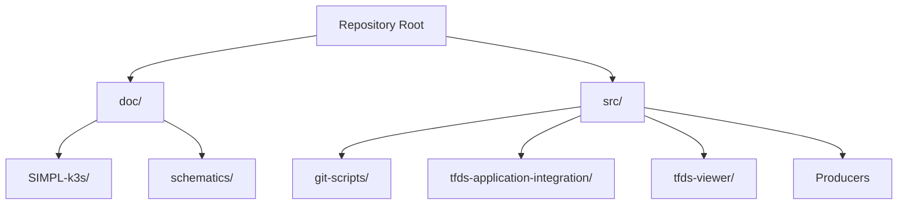

# Traffic Flow Data Space (TFDS)

Repository for the Traffic Flow Data Space (TFDS) projects data space design and development. This project is carried out in collaboration with Forum Virium Helsinki, Porto Digital, and Nationaal Dataportaal Wegverkeer (NDW).

This repository showcases the architectural designs, data production scripts, integration workflows, and visualization demonstrators developed for the TFDS initiative.

---

## Repository Structure

---

## Directory Navigation

*   **[doc/](file:///Users/tatu.erkinjuntti/Development/Repositories/SIMPL-DEV/TFDS-SIMPL/TFDS-SIMPL-OPEN_DEVELOPMENT/traffic_flow_data_space/doc)**: Documentation regarding architecture design and infrastructure deployment.
    *   **[doc/schematics/](file:///Users/tatu.erkinjuntti/Development/Repositories/SIMPL-DEV/TFDS-SIMPL/TFDS-SIMPL-OPEN_DEVELOPMENT/traffic_flow_data_space/doc/schematics)**: MermaidJS logical architecture diagrams outlining participant onboarding, authentication, publishing, querying, and data transaction processes. Read the [Schematics README](file:///Users/tatu.erkinjuntti/Development/Repositories/SIMPL-DEV/TFDS-SIMPL/TFDS-SIMPL-OPEN_DEVELOPMENT/traffic_flow_data_space/doc/schematics/README.md).
    *   **[doc/SIMPL-k3s/](file:///Users/tatu.erkinjuntti/Development/Repositories/SIMPL-DEV/TFDS-SIMPL/TFDS-SIMPL-OPEN_DEVELOPMENT/traffic_flow_data_space/doc/SIMPL-k3s)**: Guides for setting up single-node and multi-node k3s clusters for deploying SIMPL nodes. Read the [K3s Setup README](file:///Users/tatu.erkinjuntti/Development/Repositories/SIMPL-DEV/TFDS-SIMPL/TFDS-SIMPL-OPEN_DEVELOPMENT/traffic_flow_data_space/doc/SIMPL-k3s/README.md).
*   **[src/](file:///Users/tatu.erkinjuntti/Development/Repositories/SIMPL-DEV/TFDS-SIMPL/TFDS-SIMPL-OPEN_DEVELOPMENT/traffic_flow_data_space/src)**: Source code, utility tools, data producers, and integration flows. Read the [Source README](file:///Users/tatu.erkinjuntti/Development/Repositories/SIMPL-DEV/TFDS-SIMPL/TFDS-SIMPL-OPEN_DEVELOPMENT/traffic_flow_data_space/src/README.md).
    *   **Producers**: Google Apps Scripts processing real-time speed warnings, Datex II transformations, and daily flow calculations.
    *   **[src/tfds-application-integration/](file:///Users/tatu.erkinjuntti/Development/Repositories/SIMPL-DEV/TFDS-SIMPL/TFDS-SIMPL-OPEN_DEVELOPMENT/traffic_flow_data_space/src/tfds-application-integration)**: JSON exports for Google Application Integration orchestration workflows.
    *   **[src/tfds-viewer/](file:///Users/tatu.erkinjuntti/Development/Repositories/SIMPL-DEV/TFDS-SIMPL/TFDS-SIMPL-OPEN_DEVELOPMENT/traffic_flow_data_space/src/tfds-viewer)**: Interactive Leaflet map demonstrator visualizing generated data products.
    *   **[src/git-scripts/](file:///Users/tatu.erkinjuntti/Development/Repositories/SIMPL-DEV/TFDS-SIMPL/TFDS-SIMPL-OPEN_DEVELOPMENT/traffic_flow_data_space/src/git-scripts)**: Auxiliary scripts for managing code bases in local environments.
