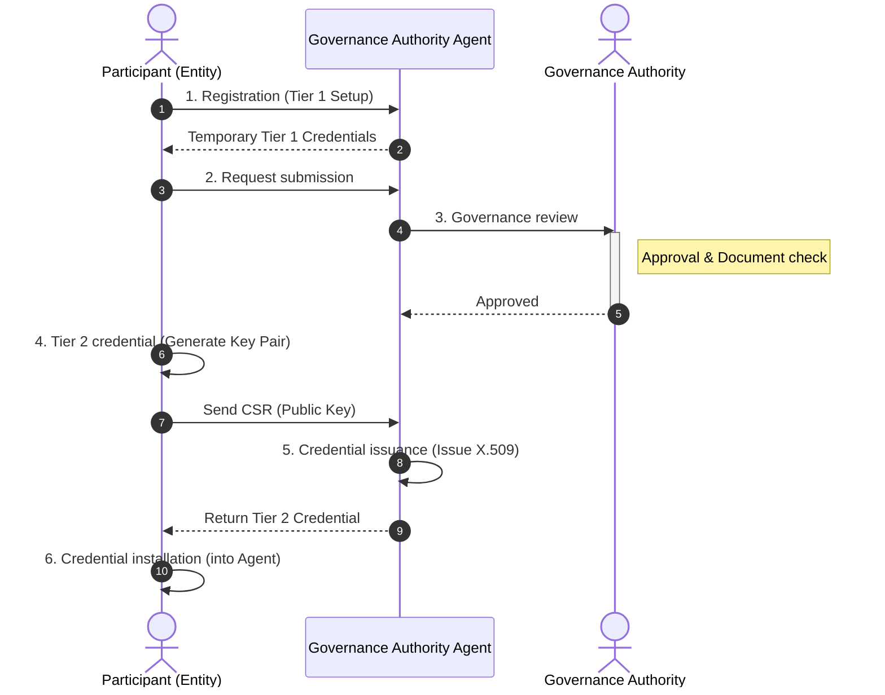

```mermaid
sequenceDiagram
    autonumber
    actor P as Participant (Entity)
    participant GAA as Governance Authority Agent
    actor  GA as Governance Authority

    %% Step 1
    P->>GAA: 1. Registration (Tier 1 Setup)
    GAA-->>P: Temporary Tier 1 Credentials

    %% Step 2
    P->>GAA: 2. Request submission

    %% Step 3
    GAA->>GA: 3. Governance review
    activate GA
    Note right of GA: Approval & Document check
    GA-->>GAA: Approved
    deactivate GA

    %% Step 4
    P->>P: 4. Tier 2 credential (Generate Key Pair)
    P->>GAA: Send CSR (Public Key)

    %% Step 5
    GAA->>GAA: 5. Credential issuance (Issue X.509)
    GAA-->>P: Return Tier 2 Credential

    %% Step 6
    P->>P: 6. Credential installation (into Agent)
```