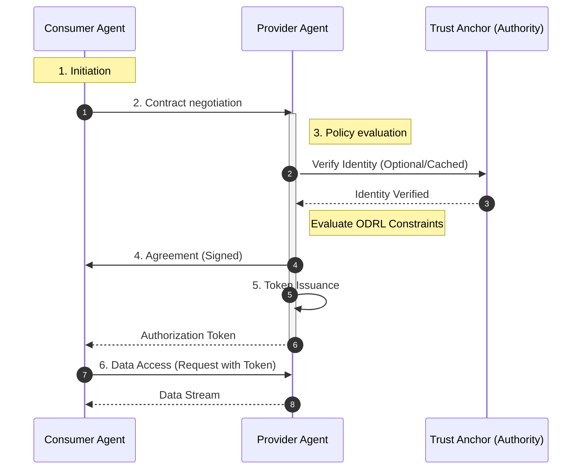

```mermaid
sequenceDiagram
    autonumber
    participant CA as Consumer Agent
    participant PA as Provider Agent
    participant GA as Trust Anchor (Authority)

    %% Step 1
    Note over CA: 1. Initiation

    %% Step 2
    CA->>PA: 2. Contract negotiation

    %% Step 3
    activate PA
        Note right of PA: 3. Policy evaluation
        PA->>GA: Verify Identity (Optional/Cached)
        GA-->>PA: Identity Verified
        Note right of PA: Evaluate ODRL Constraints

    %% Step 4
    PA->>CA: 4. Agreement (Signed)
    
    %% Step 5
    PA->>PA: 5. Token Issuance
    PA-->>CA: Authorization Token
    deactivate PA

    %% Step 6
    CA->>PA: 6. Data Access (Request with Token)
    PA-->>CA: Data Stream
```