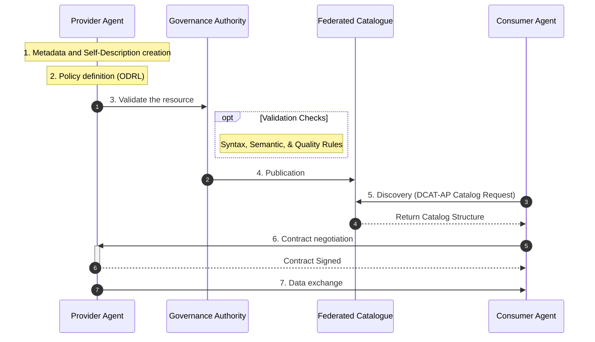

```mermaid
sequenceDiagram
    autonumber
    participant PA as Provider Agent
    participant GA as Governance Authority
    participant FC as Federated Catalogue
    participant CA as Consumer Agent

    %% Step 1: Internal creation
    
    Note over PA: 1. Metadata and Self-Description creation

    %% Step 2: Internal policy
    Note over PA: 2. Policy definition (ODRL)

    %% Step 3: Validation with Authority
    PA->>GA: 3. Validate the resource
    
    %% Internal checks performed by GA
    opt Validation Checks
        Note right of GA: Syntax, Semantic, & Quality Rules
    end

    %% Step 4: Publication to Catalogue
    GA->>FC: 4. Publication

    %% Step 5: Consumer Discovery
    CA->>FC: 5. Discovery (DCAT-AP Catalog Request)
    FC-->>CA: Return Catalog Structure

    %% Step 6: Contract Negotiation (Peer to Peer)
    CA->>PA: 6. Contract negotiation
    activate PA
    PA-->>CA: Contract Signed
    deactivate PA

    %% Step 7: Data Transfer (Peer to Peer)
    PA->>CA: 7. Data exchange
```