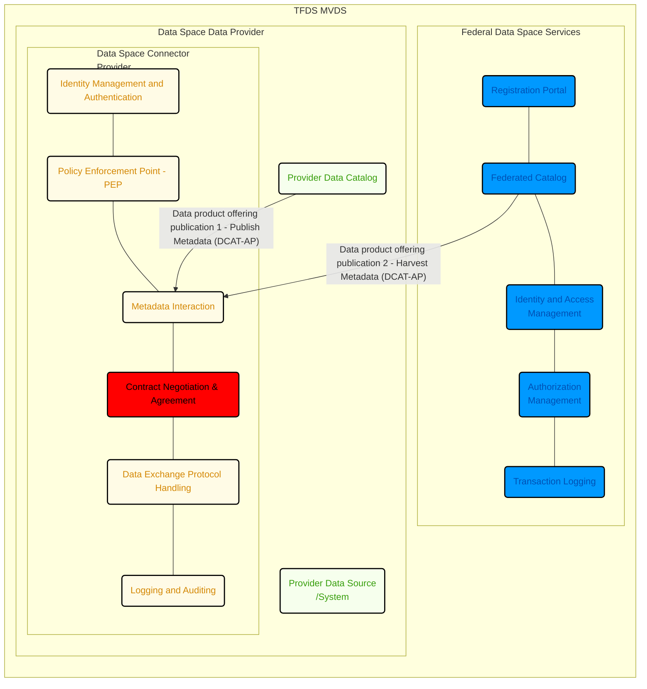

```mermaid
graph LR
    subgraph "TFDS MVDS"

        subgraph FDSC[Federal Data Space Services]
            RegPortal("Registration Portal"):::federalDS
            FedCatalog("Federated Catalog"):::federalDS
            IAM("Identity and Access<br>Management"):::federalDS
            AuthZ("Authorization<br>Management"):::federalDS
            Logger("Transaction Logging"):::federalDS

            RegPortal --- FedCatalog
            FedCatalog --- IAM
            IAM --- AuthZ
            AuthZ --- Logger

        end

        subgraph DSDP[Data Space Data Provider]
            ProviderApp("Provider Data Source<br>/System"):::providerApplication
            ProviderCatalog("Provider Data Catalog"):::providerApplication
            subgraph DSProviderDSC[Data Space Connector<br>Provider]
                ProviderDSCiam(Identity Management and Authentication):::providerDSC
                ProviderDSCpep(Policy Enforcement Point - PEP):::providerDSC
                ProviderDSCmeta(Metadata Interaction ):::providerDSC
                ProviderDSCcontract(Contract Negotiation & Agreement ):::notImplementedDSC
                ProviderDSCdataExhange(Data Exchange Protocol Handling):::providerDSC
                ProviderDSClog(Logging and Auditing):::providerDSC

                ProviderDSCiam --- ProviderDSCpep
                ProviderDSCpep --- ProviderDSCmeta
                ProviderDSCmeta --- ProviderDSCcontract
                ProviderDSCcontract --- ProviderDSCdataExhange
                ProviderDSCdataExhange --- ProviderDSClog
            end
        end

        %% Data space provider data product offering publication

        ProviderCatalog -- "Data product offering publication 1 - Publish Metadata (DCAT-AP)" --> ProviderDSCmeta
        FedCatalog -- "Data product offering publication 2 - Harvest Metadata (DCAT-AP)" --> ProviderDSCmeta

       
        %% TODO: Styling once the schematic is in it's final phases.
        
        
        %% Style Definitions for classes
        classDef federalDS fill:#0099ff,stroke:#000000,stroke-width:2px,color:#0050b3
        classDef providerApplication fill:#f6ffed,stroke:#000000,stroke-width:2px,color:#389e0d
        classDef consumerApplication fill:#fffbe6,stroke:#000000,stroke-width:2px,color:#d48806

        classDef providerDSC fill:#fffbe6,stroke:#000000,stroke-width:2px,color:#d48806
        classDef ConsumerDSC fill:#fffbe6,stroke:#000000,stroke-width:2px,color:#d48806
        classDef notImplementedDSC fill:#ff0000,stroke:#000000,stroke-width:2px,color:#000000

        classDef userDS fill:#fffbe6,stroke:#000000,stroke-width:2px,color:#d48806


        %% Style Definitions for graphs
        %%style FDSC fill:#fffbe6, color:#000000,  strokeWidth: 2, verticalAlign: top, fontStyle:1
    end
```