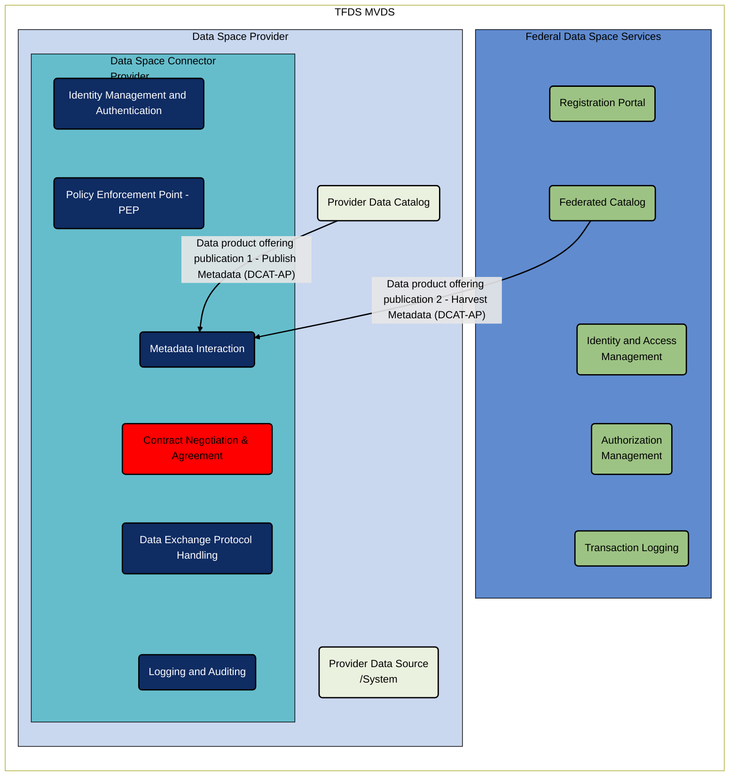

```mermaid
graph LR
    subgraph TfdsMvds["TFDS MVDS"]

        subgraph FdSs["Federal Data Space Services"]
            RegPortal("Registration Portal"):::federalDS
            FedCatalog("Federated Catalog"):::federalDS
            IAM("Identity and Access<br>Management"):::federalDS
            AuthZ("Authorization<br>Management"):::federalDS
            Logger("Transaction Logging"):::federalDS

            RegPortal --- FedCatalog
            FedCatalog --- IAM
            IAM --- AuthZ
            AuthZ --- Logger
        end

        subgraph DsDp["Data Space Provider"]
            ProviderApp("Provider Data Source<br>/System"):::providerApplication
            ProviderCatalog("Provider Data Catalog"):::providerApplication
            subgraph DSProviderDSC["Data Space Connector<br>Provider"]
                ProviderDSCiam("Identity Management and Authentication"):::providerDSC
                ProviderDSCpep("Policy Enforcement Point - PEP"):::providerDSC
                ProviderDSCmeta("Metadata Interaction"):::providerDSC
                ProviderDSCcontract("Contract Negotiation & Agreement"):::notImplementedDSC
                ProviderDSCdataExhange("Data Exchange Protocol Handling"):::providerDSC
                ProviderDSClog("Logging and Auditing"):::providerDSC

                ProviderDSCiam --- ProviderDSCpep
                ProviderDSCpep --- ProviderDSCmeta
                ProviderDSCmeta --- ProviderDSCcontract
                ProviderDSCcontract --- ProviderDSCdataExhange
                ProviderDSCdataExhange --- ProviderDSClog
            end
        end

        %% Data space provider data product offering publication

        ProviderCatalog -- "Data product offering publication 1 - Publish Metadata (DCAT-AP)" --> ProviderDSCmeta
        FedCatalog -- "Data product offering publication 2 - Harvest Metadata (DCAT-AP)" --> ProviderDSCmeta

        %% Style Definitions

        %% Style : TFDS MVDS
        style TfdsMvds fill:#ffffff, color:#000000, strokeWidth: 2, verticalAlign: top, fontStyle:1
    
        %% Style : Federal Sata Space Services
        style FdSs fill:#608bcf, color:#000000, stroke: #000000, strokeWidth: 2, verticalAlign: top, fontStyle:1
        %% Class definition : Federal Sata Space Services components
        classDef federalDS fill:#9dc384, color:#000000, stroke:#000000, stroke-width:2px, fontStyle:1

        %% Style : Data Space Provider
        style DsDp fill:#c9d7ef, color:#000000, stroke:#000000, strokeWidth: 2, verticalAlign: top, fontStyle:1
        %% Style : Data Space Provider Data Space Connector
        style DSProviderDSC fill:#65bdcc, color:#000000, stroke:#000000, strokeWidth: 2, verticalAlign: top, fontStyle:1
        %% Class definition : Data Space Provider components
        classDef providerDSC fill:#0f2c63, color:#ffffff, stroke:#000000, stroke-width:2px, fontStyle:1
        %% Class definition : Data Space Provider Application
        classDef providerApplication fill:#ebf1df, color:#000000, stroke:#000000, stroke-width:2px, fontStyle:1

        %% Class definition : Data Space Connector components not planned
        classDef notImplementedDSC fill:#ff0000, color:#000000, stroke:#000000, stroke-width:2px, fontStyle:1


        %% Style for linking lines
        linkStyle default color:#000000, stroke:#000000, stroke-width:2px, fill:none
        classDef linkTextBox color:#ffffff, stroke:#000000, stroke-width:2px, fill:none
        %% Hide non arrow links, we want them grouped but with no visible lines.
        linkStyle 0 stroke:none
        linkStyle 1 stroke:none
        linkStyle 2 stroke:none
        linkStyle 3 stroke:none
        linkStyle 4 stroke:none
        linkStyle 5 stroke:none
        linkStyle 6 stroke:none
        linkStyle 7 stroke:none
        linkStyle 8 stroke:none
    end 
```