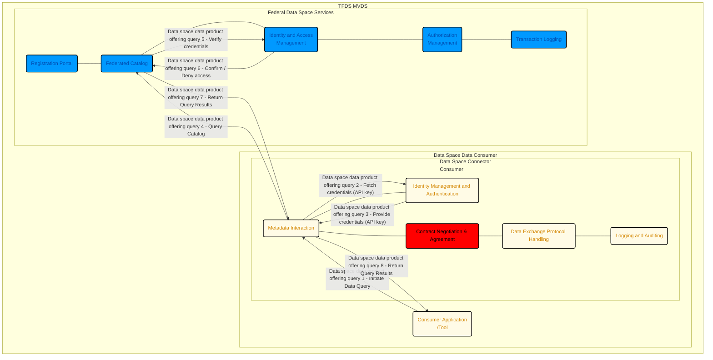

```mermaid
graph 
    subgraph "TFDS MVDS"

        subgraph DSDC[Data Space Data Consumer]
            ConsumerApp("Consumer Application<br>/Tool"):::consumerApplication
            subgraph DSConsumerDSC[Data Space Connector<br>Consumer]
                ConsumerDSCiam(Identity Management and Authentication):::ConsumerDSC
                ConsumerDSCmeta(Metadata Interaction ):::ConsumerDSC
                ConsumerDSCcontract(Contract Negotiation & Agreement ):::notImplementedDSC
                ConsumerDSCdataExhange(Data Exchange Protocol Handling):::ConsumerDSC
                ConsumerDSClog(Logging and Auditing):::ConsumerDSC

                ConsumerDSCiam --- ConsumerDSCmeta
                ConsumerDSCmeta --- ConsumerDSCcontract
                ConsumerDSCcontract --- ConsumerDSCdataExhange
                ConsumerDSCdataExhange --- ConsumerDSClog
            end
        end

        subgraph FDSC[Federal Data Space Services]
            RegPortal("Registration Portal"):::federalDS
            FedCatalog("Federated Catalog"):::federalDS
            IAM("Identity and Access<br>Management"):::federalDS
            AuthZ("Authorization<br>Management"):::federalDS
            Logger("Transaction Logging"):::federalDS

            RegPortal --- FedCatalog
            FedCatalog --- IAM
            IAM --- AuthZ
            AuthZ --- Logger

        end

        %% Data space Query
        ConsumerApp -- "Data space data product offering query 1 - Initiate Data Query" --> ConsumerDSCmeta
        ConsumerDSCmeta --"Data space data product offering query 2 - Fetch credentials (API key)"--> ConsumerDSCiam
        ConsumerDSCiam --"Data space data product offering query 3 - Provide credentials (API key)"--> ConsumerDSCmeta
        ConsumerDSCmeta -- "Data space data product offering query 4 - Query Catalog" --> FedCatalog
        FedCatalog --"Data space data product offering query 5 - Verify credentials"--> IAM
        IAM --"Data space data product offering query 6 - Confirm / Deny access"-->FedCatalog
        FedCatalog -- "Data space data product offering query 7 - Return Query Results" --> ConsumerDSCmeta
        ConsumerDSCmeta -- "Data space data product offering query 8 - Return Query Results" --> ConsumerApp

        %% TODO: Styling once the schematic is in it's final phases.
        
        
        %% Style Definitions for classes
        classDef federalDS fill:#0099ff,stroke:#000000,stroke-width:2px,color:#0050b3
        classDef providerApplication fill:#f6ffed,stroke:#000000,stroke-width:2px,color:#389e0d
        classDef consumerApplication fill:#fffbe6,stroke:#000000,stroke-width:2px,color:#d48806

        classDef providerDSC fill:#fffbe6,stroke:#000000,stroke-width:2px,color:#d48806
        classDef ConsumerDSC fill:#fffbe6,stroke:#000000,stroke-width:2px,color:#d48806
        classDef notImplementedDSC fill:#ff0000,stroke:#000000,stroke-width:2px,color:#000000

        classDef userDS fill:#fffbe6,stroke:#000000,stroke-width:2px,color:#d48806


        %% Style Definitions for graphs
        %%style FDSC fill:#fffbe6, color:#000000,  strokeWidth: 2, verticalAlign: top, fontStyle:1
    end
```