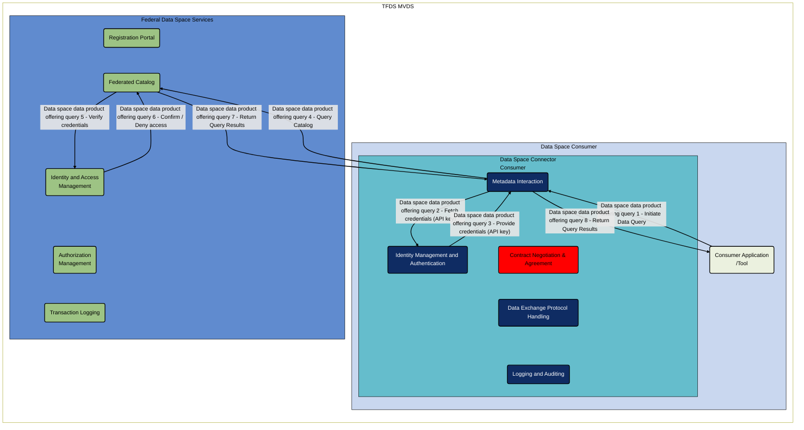

```mermaid
graph LR
    subgraph TfdsMvds["TFDS MVDS"]

        subgraph DsDc["Data Space Consumer"]
            ConsumerApp("Consumer Application<br>/Tool"):::consumerApplication
            subgraph DSConsumerDSC["Data Space Connector<br>Consumer"]
                ConsumerDSCiam("Identity Management and Authentication"):::ConsumerDSC
                ConsumerDSCmeta("Metadata Interaction"):::ConsumerDSC
                ConsumerDSCcontract("Contract Negotiation & Agreement"):::notImplementedDSC
                ConsumerDSCdataExhange("Data Exchange Protocol Handling"):::ConsumerDSC
                ConsumerDSClog("Logging and Auditing"):::ConsumerDSC

                ConsumerDSCiam --- ConsumerDSCmeta
                ConsumerDSCmeta --- ConsumerDSCcontract
                ConsumerDSCcontract --- ConsumerDSCdataExhange
                ConsumerDSCdataExhange --- ConsumerDSClog
            end
        end

        subgraph FdSs["Federal Data Space Services"]
            RegPortal("Registration Portal"):::federalDS
            FedCatalog("Federated Catalog"):::federalDS
            IAM("Identity and Access<br>Management"):::federalDS
            AuthZ("Authorization<br>Management"):::federalDS
            Logger("Transaction Logging"):::federalDS

            RegPortal --- FedCatalog
            FedCatalog --- IAM
            IAM --- AuthZ
            AuthZ --- Logger
        end

        %% Data space Query
        ConsumerApp -- "Data space data product offering query 1 - Initiate Data Query" --> ConsumerDSCmeta
        ConsumerDSCmeta --"Data space data product offering query 2 - Fetch credentials (API key)"--> ConsumerDSCiam
        ConsumerDSCiam --"Data space data product offering query 3 - Provide credentials (API key)"--> ConsumerDSCmeta
        ConsumerDSCmeta -- "Data space data product offering query 4 - Query Catalog" --> FedCatalog
        FedCatalog --"Data space data product offering query 5 - Verify credentials"--> IAM
        IAM --"Data space data product offering query 6 - Confirm / Deny access"-->FedCatalog
        FedCatalog -- "Data space data product offering query 7 - Return Query Results" --> ConsumerDSCmeta
        ConsumerDSCmeta -- "Data space data product offering query 8 - Return Query Results" --> ConsumerApp

        %% Style Definitions

        %% Style : TFDS MVDS
        style TfdsMvds fill:#ffffff, color:#000000, strokeWidth: 2, verticalAlign: top, fontStyle:1
    
        %% Style : Federal Sata Space Services
        style FdSs fill:#608bcf, color:#000000, stroke: #000000, strokeWidth: 2, verticalAlign: top, fontStyle:1
        %% Class definition : Federal Sata Space Services components
        classDef federalDS fill:#9dc384, color:#000000, stroke:#000000, stroke-width:2px, fontStyle:1

        %% Style : Data Space Consumer
        style DsDc fill:#c9d7ef, color:#000000, stroke:#000000, strokeWidth: 2, verticalAlign: top, fontStyle:1
        %% Style : Data Space Consumer Data Space Connector
        style DSConsumerDSC fill:#65bdcc, color:#000000, stroke:#000000, strokeWidth: 2, verticalAlign: top, fontStyle:1
        %% Class definition : Data Space Consumer Data Space Connector components
        classDef ConsumerDSC fill:#0f2c63, color:#ffffff, stroke:#000000, stroke-width:2px, fontStyle:1
        %% Class definition : Data Space Consumer Application
        classDef consumerApplication fill:#ebf1df, color:#000000, stroke:#000000, stroke-width:2px, fontStyle:1

        %% Class definition : Data Space Connector components not planned
        classDef notImplementedDSC fill:#ff0000, color:#000000, stroke:#000000, stroke-width:2px, fontStyle:1


        %% Style for linking lines
        linkStyle default color:#000000, stroke:#000000, stroke-width:2px, fill:none
        classDef linkTextBox color:#ffffff, stroke:#000000, stroke-width:2px, fill:none

        %% Hide non arrow links, we want them grouped but with no visible lines.
        linkStyle 0 stroke:none
        linkStyle 1 stroke:none
        linkStyle 2 stroke:none
        linkStyle 3 stroke:none
        linkStyle 4 stroke:none
        linkStyle 5 stroke:none
        linkStyle 6 stroke:none
        linkStyle 7 stroke:none
        %% linkStyle 8 stroke:none
        %% linkStyle 9 stroke:none
        %% linkStyle 10 stroke:none
        %% linkStyle 11 stroke:none
        %% linkStyle 12 stroke:none
    end 
```