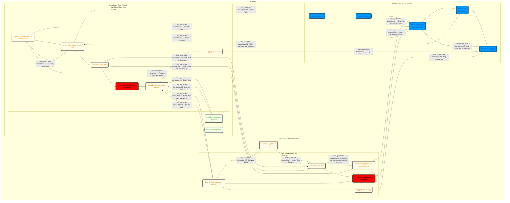

```mermaid
graph
    subgraph "TFDS MVDS"

        subgraph DSDC[Data Space Data Consumer]
            ConsumerApp("Consumer Application<br>/Tool"):::consumerApplication
            subgraph DSConsumerDSC[Data Space Connector<br>Consumer]
                ConsumerDSCiam(Identity Management and Authentication):::ConsumerDSC
                ConsumerDSCmeta(Metadata Interaction ):::ConsumerDSC
                ConsumerDSCcontract(Contract Negotiation & Agreement ):::notImplementedDSC
                ConsumerDSCdataExhange(Data Exchange Protocol Handling):::ConsumerDSC
                ConsumerDSClog(Logging and Auditing):::ConsumerDSC

                ConsumerDSCiam --- ConsumerDSCmeta
                ConsumerDSCmeta --- ConsumerDSCcontract
                ConsumerDSCcontract --- ConsumerDSCdataExhange
                ConsumerDSCdataExhange --- ConsumerDSClog
            end
        end

        subgraph FDSC[Federal Data Space Services]
            RegPortal("Registration Portal"):::federalDS
            FedCatalog("Federated Catalog"):::federalDS
            IAM("Identity and Access<br>Management"):::federalDS
            AuthZ("Authorization<br>Management"):::federalDS
            Logger("Transaction Logging"):::federalDS

            RegPortal --- FedCatalog
            FedCatalog --- IAM
            IAM --- AuthZ
            AuthZ --- Logger

        end

        subgraph DSDP[Data Space Data Provider]
            ProviderApp("Provider Data Source<br>/System"):::providerApplication
            ProviderCatalog("Provider Data Catalog"):::providerApplication
            subgraph DSProviderDSC[Data Space Connector<br>Provider]
                ProviderDSCiam(Identity Management and Authentication):::providerDSC
                ProviderDSCpep(Policy Enforcement Point - PEP):::providerDSC
                ProviderDSCmeta(Metadata Interaction ):::providerDSC
                ProviderDSCcontract(Contract Negotiation & Agreement ):::notImplementedDSC
                ProviderDSCdataExhange(Data Exchange Protocol Handling):::providerDSC
                ProviderDSClog(Logging and Auditing):::providerDSC

                ProviderDSCiam --- ProviderDSCpep
                ProviderDSCpep --- ProviderDSCmeta
                ProviderDSCmeta --- ProviderDSCcontract
                ProviderDSCcontract --- ProviderDSCdataExhange
                ProviderDSCdataExhange --- ProviderDSClog
            end
        end
        %% Data space transaction

        ConsumerApp -- "Data space data transaction 1 - Initiate Data Request" --> ConsumerDSCmeta
        ConsumerDSCmeta -- "Data space data transaction 2 - Select data set from catalog" --> ProviderDSCmeta
        ProviderDSCmeta -- "Data space data transaction 3 - Return data set location" --> ConsumerDSCmeta
        ConsumerDSCmeta -- "Data space data transaction 4 - Pass data set resource location for request" --> ConsumerDSCiam
        ConsumerDSCiam -- "Data space data transaction 5 - Request Access Assertion" --> IAM
        IAM -- "Data space data transaction 6 - Issue Access Assertion" --> ConsumerDSCiam
        ConsumerDSCiam -- "Data space data transaction 7 - Request Data - Assertion" --> ProviderDSCiam
        ProviderDSCiam -- "Data space data transaction 8 - Validate Assertion" --> IAM
        IAM -- "Data space data transaction 9 - Confirm assertion" --> ProviderDSCiam
        IAM -- "Data space data transaction 10 - Log assertion confirmation" --> Logger
        ProviderDSCiam -- "Data space data transaction 11 - To policy validation" --> ProviderDSCpep
        ProviderDSCpep -- "Data space data transaction 12 - Check Policy" --> AuthZ
        AuthZ -- "Data space data transaction 12 - Policy Decision (Allow/Deny)" --> ProviderDSCpep 
        ConsumerDSCdataExhange -- "Data space data transaction 13 - Request data" --> ProviderDSCdataExhange
        ProviderDSCdataExhange -- "Data space data transaction 14 - Fetch Data" --> ProviderApp
        ProviderApp -- "Data space data transaction 15 - Provide Data" --> ProviderDSCdataExhange
        ProviderDSCdataExhange -- "Data space data transaction 16 - Send Data (e.g., DATEX II)" --> ConsumerDSCdataExhange
        ConsumerDSCdataExhange -- "Data space data transaction 17 - Forward Data" --> ConsumerApp
        ProviderDSClog -- "Data space data transaction 18 - Log Transaction" --> Logger
        ConsumerDSClog -- "Data space data transaction 19 - Log Transaction" --> Logger

        %% TODO: Styling once the schematic is in it's final phases.
        
        
        %% Style Definitions for classes
        classDef federalDS fill:#0099ff,stroke:#000000,stroke-width:2px,color:#0050b3
        classDef providerApplication fill:#f6ffed,stroke:#000000,stroke-width:2px,color:#389e0d
        classDef consumerApplication fill:#fffbe6,stroke:#000000,stroke-width:2px,color:#d48806

        classDef providerDSC fill:#fffbe6,stroke:#000000,stroke-width:2px,color:#d48806
        classDef ConsumerDSC fill:#fffbe6,stroke:#000000,stroke-width:2px,color:#d48806
        classDef notImplementedDSC fill:#ff0000,stroke:#000000,stroke-width:2px,color:#000000

        classDef userDS fill:#fffbe6,stroke:#000000,stroke-width:2px,color:#d48806


        %% Style Definitions for graphs
        %%style FDSC fill:#fffbe6, color:#000000,  strokeWidth: 2, verticalAlign: top, fontStyle:1
    end
```