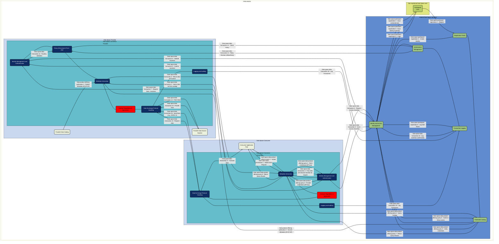

```mermaid
graph TB
    subgraph TfdsMvds["TFDS MVDS"]

        subgraph DsDc["Data Space Consumer"]
            ConsumerApp("Consumer Application<br>/Tool"):::consumerApplication
            subgraph DSConsumerDSC["Data Space Connector<br>Consumer"]
                ConsumerDSCiam("Identity Management and Authentication"):::ConsumerDSC
                ConsumerDSCmeta("Metadata Interaction"):::ConsumerDSC
                ConsumerDSCcontract("Contract Negotiation & Agreement"):::notImplementedDSC
                ConsumerDSCdataExhange("Data Exchange Protocol Handling"):::ConsumerDSC
                ConsumerDSClog("Logging and Auditing"):::ConsumerDSC

                ConsumerDSCiam --- ConsumerDSCmeta
                ConsumerDSCmeta --- ConsumerDSCcontract
                ConsumerDSCcontract --- ConsumerDSCdataExhange
                ConsumerDSCdataExhange --- ConsumerDSClog
            end
        end

        subgraph DsU["Non registered Data Space user"]
            User("Participant/<br>User"):::userDS
        end

        subgraph FdSs["Federal Data Space Services"]
            RegPortal("Registration Portal"):::federalDS
            FedCatalog("Federated Catalog"):::federalDS
            IAM("Identity and Access<br>Management"):::federalDS
            AuthZ("Authorization<br>Management"):::federalDS
            Logger("Transaction Logging"):::federalDS

            RegPortal --- FedCatalog
            FedCatalog --- IAM
            IAM --- AuthZ
            AuthZ --- Logger
        end

        subgraph DsDp["Data Space Provider"]
            ProviderApp("Provider Data Source<br>/System"):::providerApplication
            ProviderCatalog("Provider Data Catalog"):::providerApplication
            subgraph DSProviderDSC["Data Space Connector<br>Provider"]
                ProviderDSCiam("Identity Management and Authentication"):::providerDSC
                ProviderDSCpep("Policy Enforcement Point - PEP"):::providerDSC
                ProviderDSCmeta("Metadata Interaction"):::providerDSC
                ProviderDSCcontract("Contract Negotiation & Agreement"):::notImplementedDSC
                ProviderDSCdataExhange("Data Exchange Protocol Handling"):::providerDSC
                ProviderDSClog("Logging and Auditing"):::providerDSC

                ProviderDSCiam --- ProviderDSCpep
                ProviderDSCpep --- ProviderDSCmeta
                ProviderDSCmeta --- ProviderDSCcontract
                ProviderDSCcontract --- ProviderDSCdataExhange
                ProviderDSCdataExhange --- ProviderDSClog
            end
        end

        %% Data space participant registration
        User -- "Data space participant registration 1 - Register" --> RegPortal
        RegPortal -- "Data space participant registration 2 - Create Identity" --> IAM
        IAM -- "Data space participant registration 3 - Issue credendentials" --> User
        User -- "Data space participant registration 4 - Login" --> IAM
        IAM -- "Data space participant registration 5 - Issue Identity Assertion" --> User
        IAM -- "Data space participant registration 6 - Log Auth Event" --> Logger

        %% Data space provider data product offering publication

        ProviderCatalog -- "Data product offering publication 1 - Publish Metadata (DCAT-AP)" --> ProviderDSCmeta
        FedCatalog -- "Data product offering publication 2 - Harvest Metadata (DCAT-AP)" --> ProviderDSCmeta

        %% Data space Query
        ConsumerApp -- "Data space data product offering query 1 - Initiate Data Query" --> ConsumerDSCmeta
        ConsumerDSCmeta --"Data space data product offering query 2 - Fetch credentials (API key)"--> ConsumerDSCiam
        ConsumerDSCiam --"Data space data product offering query 3 - Provide credentials (API key)"--> ConsumerDSCmeta
        ConsumerDSCmeta -- "Data space data product offering query 4 - Query Catalog" --> FedCatalog
        FedCatalog --"Data space data product offering query 5 - Verify credentials"--> IAM
        IAM --"Data space data product offering query 6 - Confirm / Deny access"-->FedCatalog
        FedCatalog -- "Data space data product offering query 7 - Return Query Results" --> ConsumerDSCmeta
        ConsumerDSCmeta -- "Data space data product offering query 8 - Return Query Results" --> ConsumerApp

        %% Data space transaction

        ConsumerApp -- "Data space data transaction 1 - Initiate Data Request" --> ConsumerDSCmeta
        ConsumerDSCmeta -- "Data space data transaction 2 - Select data set from catalog" --> ProviderDSCmeta
        ProviderDSCmeta -- "Data space data transaction 3 - Return data set location" --> ConsumerDSCmeta
        ConsumerDSCmeta -- "Data space data transaction 4 - Pass data set resource location for request" --> ConsumerDSCiam
        ConsumerDSCiam -- "Data space data transaction 5 - Request Access Assertion" --> IAM
        IAM -- "Data space data transaction 6 - Issue Access Assertion" --> ConsumerDSCiam
        ConsumerDSCiam -- "Data space data transaction 7 - Request Data - Assertion" --> ProviderDSCiam
        ProviderDSCiam -- "Data space data transaction 8 - Validate Assertion" --> IAM
        IAM -- "Data space data transaction 9 - Confirm assertion" --> ProviderDSCiam
        IAM -- "Data space data transaction 10 - Log assertion confirmation" --> Logger
        ProviderDSCiam -- "Data space data transaction 11 - To policy validation" --> ProviderDSCpep
        ProviderDSCpep -- "Data space data transaction 12 - Check Policy" --> AuthZ
        AuthZ -- "Data space data transaction 12 - Policy Decision (Allow/Deny)" --> ProviderDSCpep 
        ConsumerDSCdataExhange -- "Data space data transaction 13 - Request data" --> ProviderDSCdataExhange
        ProviderDSCdataExhange -- "Data space data transaction 14 - Fetch Data" --> ProviderApp
        ProviderApp -- "Data space data transaction 15 - Provide Data" --> ProviderDSCdataExhange
        ProviderDSCdataExhange -- "Data space data transaction 16 - Send Data (e.g., DATEX II)" --> ConsumerDSCdataExhange
        ConsumerDSCdataExhange -- "Data space data transaction 17 - Forward Data" --> ConsumerApp
        ProviderDSClog -- "Data space data transaction 18 - Log Transaction" --> Logger
        ConsumerDSClog -- "Data space data transaction 19 - Log Transaction" --> Logger

        %% Style Definitions

        %% Style : TFDS MVDS
        style TfdsMvds fill:#ffffff, color:#000000, strokeWidth: 2, verticalAlign: top, fontStyle:1
    
        %% Style : Federal Sata Space Services
        style FdSs fill:#608bcf, color:#000000, stroke: #000000, strokeWidth: 2, verticalAlign: top, fontStyle:1
        %% Class definition : Federal Sata Space Services components
        classDef federalDS fill:#9dc384, color:#000000, stroke:#000000, stroke-width:2px, fontStyle:1

        %% Style : Data space unregistered user
        style DsU fill:#e0e782, color:#000000, stroke:#000000, strokeWidth:2, verticalAlign:top, fontStyle:1
        %% Class definition : Data space unregistered user "components"
        classDef userDS fill:#b7cd67, color:#000000, stroke:#000000, stroke-width:2px, fontStyle:1

        %% Style : Data Space Provider
        style DsDp fill:#c9d7ef, color:#000000, stroke:#000000, strokeWidth: 2, verticalAlign: top, fontStyle:1
        %% Style : Data Space Provider Data Space Connector
        style DSProviderDSC fill:#65bdcc, color:#000000, stroke:#000000, strokeWidth: 2, verticalAlign: top, fontStyle:1
        %% Class definition : Data Space Provider components
        classDef providerDSC fill:#0f2c63, color:#ffffff, stroke:#000000, stroke-width:2px, fontStyle:1
        %% Class definition : Data Space Provider Application
        classDef providerApplication fill:#ebf1df, color:#000000, stroke:#000000, stroke-width:2px, fontStyle:1

        %% Style : Data Space Consumer
        style DsDc fill:#c9d7ef, color:#000000, stroke:#000000, strokeWidth: 2, verticalAlign: top, fontStyle:1
        %% Style : Data Space Consumer Data Space Connector
        style DSConsumerDSC fill:#65bdcc, color:#000000, stroke:#000000, strokeWidth: 2, verticalAlign: top, fontStyle:1
        %% Class definition : Data Space Consumer Data Space Connector components
        classDef ConsumerDSC fill:#0f2c63, color:#ffffff, stroke:#000000, stroke-width:2px, fontStyle:1
        %% Class definition : Data Space Consumer Application
        classDef consumerApplication fill:#ebf1df, color:#000000, stroke:#000000, stroke-width:2px, fontStyle:1

        %% Class definition : Data Space Connector components not planned
        classDef notImplementedDSC fill:#ff0000, color:#000000, stroke:#000000, stroke-width:2px, fontStyle:1


        %% Style for linking lines
        linkStyle default color:#000000, stroke:#000000, stroke-width:2px, fill:none
        classDef linkTextBox color:#ffffff, stroke:#000000, stroke-width:2px, fill:none
    end 
```