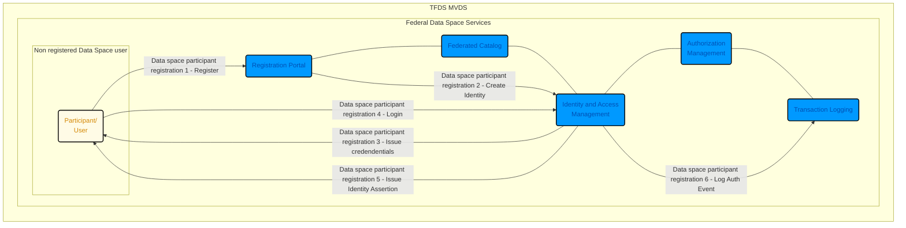

```mermaid
graph LR
    subgraph "TFDS MVDS"

        subgraph FDSC[Federal Data Space Services]
            RegPortal("Registration Portal"):::federalDS
            FedCatalog("Federated Catalog"):::federalDS
            IAM("Identity and Access<br>Management"):::federalDS
            AuthZ("Authorization<br>Management"):::federalDS
            Logger("Transaction Logging"):::federalDS

            RegPortal --- FedCatalog
            FedCatalog --- IAM
            IAM --- AuthZ
            AuthZ --- Logger

            subgraph NDSP[Non registered Data Space user]
                User("Participant/<br>User"):::userDS
            end
        end

        %% Data space participant registration
        User -- "Data space participant registration 1 - Register" --> RegPortal
        RegPortal -- "Data space participant registration 2 - Create Identity" --> IAM
        IAM -- "Data space participant registration 3 - Issue credendentials" --> User
        User -- "Data space participant registration 4 - Login" --> IAM
        IAM -- "Data space participant registration 5 - Issue Identity Assertion" --> User
        IAM -- "Data space participant registration 6 - Log Auth Event" --> Logger

        %% TODO: Styling once the schematic is in it's final phases.
        
        
        %% Style Definitions for classes
        classDef federalDS fill:#0099ff,stroke:#000000,stroke-width:2px,color:#0050b3
        classDef providerApplication fill:#f6ffed,stroke:#000000,stroke-width:2px,color:#389e0d
        classDef consumerApplication fill:#fffbe6,stroke:#000000,stroke-width:2px,color:#d48806

        classDef providerDSC fill:#fffbe6,stroke:#000000,stroke-width:2px,color:#d48806
        classDef ConsumerDSC fill:#fffbe6,stroke:#000000,stroke-width:2px,color:#d48806
        classDef notImplementedDSC fill:#ff0000,stroke:#000000,stroke-width:2px,color:#000000

        classDef userDS fill:#fffbe6,stroke:#000000,stroke-width:2px,color:#d48806


        %% Style Definitions for graphs
        %%style FDSC fill:#fffbe6, color:#000000,  strokeWidth: 2, verticalAlign: top, fontStyle:1
    end
```