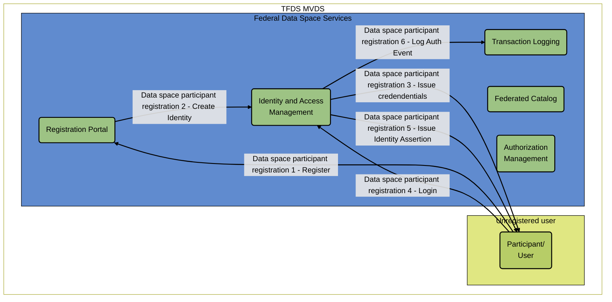

```mermaid
graph TB
    subgraph TfdsMvds["TFDS MVDS"]

        subgraph DsU["Unregistered user"]
            User("Participant/<br>User"):::userDS
        end

        subgraph FdSs["Federal Data Space Services"]
            RegPortal("Registration Portal"):::federalDS
            FedCatalog("Federated Catalog"):::federalDS
            IAM("Identity and Access<br>Management"):::federalDS
            AuthZ("Authorization<br>Management"):::federalDS
            Logger("Transaction Logging"):::federalDS
        end

        %% Data space participant registration
        User -- "Data space participant registration 1 - Register" --> RegPortal
        RegPortal -- "Data space participant registration 2 - Create Identity" --> IAM
        IAM -- "Data space participant registration 3 - Issue credendentials" --> User
        User -- "Data space participant registration 4 - Login" --> IAM
        IAM -- "Data space participant registration 5 - Issue Identity Assertion" --> User
        IAM -- "Data space participant registration 6 - Log Auth Event" --> Logger        

        %% Style Definitions

        %% Style : TFDS MVDS
        style TfdsMvds fill:#ffffff, color:#000000, strokeWidth: 2, verticalAlign: top, fontStyle:1
    
        %% Style : Federal Sata Space Services
        style FdSs fill:#608bcf, color:#000000, stroke: #000000, strokeWidth: 2, verticalAlign: top, fontStyle:1
        %% Class definition : Federal Sata Space Services components
        classDef federalDS fill:#9dc384, color:#000000, stroke:#000000, stroke-width:2px, fontStyle:1

        %% Style : Data space unregistered user
        style DsU fill:#e0e782, color:#000000, stroke:#000000, strokeWidth:2, verticalAlign:top, fontStyle:1
        %% Class definition : Data space unregistered user "components"
        classDef userDS fill:#b7cd67, color:#000000, stroke:#000000, stroke-width:2px, fontStyle:1

        %% Style for linking lines
        linkStyle default color:#000000, stroke:#000000, stroke-width:2px, fill:none
        classDef linkTextBox color:#ffffff, stroke:#000000, stroke-width:2px, fill:none
    end
```