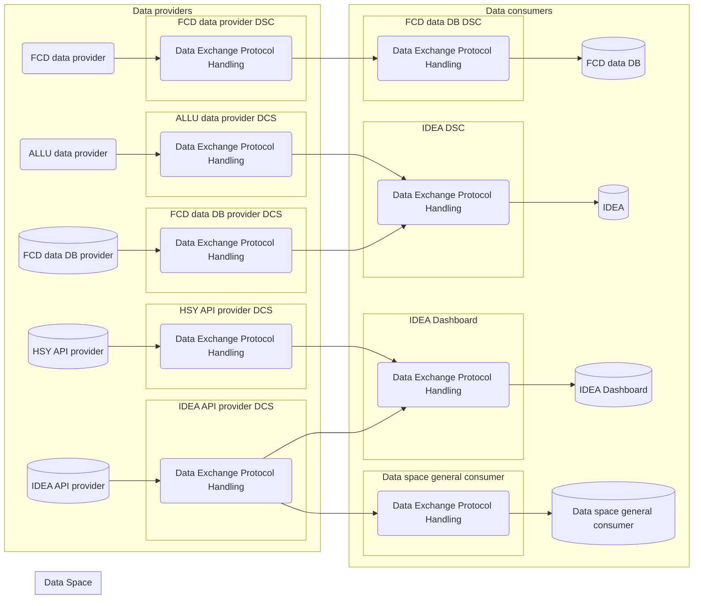

```mermaid
graph LR
    subgraph DataConsumers[Data consumers]
        FCD_data_hoarder[("FCD data DB")]:::dataC

        subgraph DSConsumerDSC1[FCD data DB DSC]
            %%ConsumerDSCiam(Identity Management and Authentication):::ConsumerDSC
            %%ConsumerDSCmeta(Metadata Interaction ):::ConsumerDSC
            %%ConsumerDSCcontract(Contract Negotiation & Agreement ):::notImplementedDSC
            ConsumerDSCdataExhange1(Data Exchange Protocol Handling):::ConsumerDSC
            %%ConsumerDSClog(Logging and Auditing):::ConsumerDSC
        end

        IDEA[("IDEA")]:::dataC

        subgraph DSConsumerDSC2[IDEA DSC]
            %%ConsumerDSCiam(Identity Management and Authentication):::ConsumerDSC
            %%ConsumerDSCmeta(Metadata Interaction ):::ConsumerDSC
            %%ConsumerDSCcontract(Contract Negotiation & Agreement ):::notImplementedDSC
            ConsumerDSCdataExhange2(Data Exchange Protocol Handling):::ConsumerDSC
            %%ConsumerDSClog(Logging and Auditing):::ConsumerDSC
        end

        IDEA_D[("IDEA Dashboard")]:::dataC

        subgraph DSConsumerDSC3[IDEA Dashboard]
            %%ConsumerDSCiam(Identity Management and Authentication):::ConsumerDSC
            %%ConsumerDSCmeta(Metadata Interaction ):::ConsumerDSC
            %%ConsumerDSCcontract(Contract Negotiation & Agreement ):::notImplementedDSC
            ConsumerDSCdataExhange3(Data Exchange Protocol Handling):::ConsumerDSC
            %%ConsumerDSClog(Logging and Auditing):::ConsumerDSC
        end

        DsConsumer[("Data space general consumer")]:::dataC

        subgraph DSConsumerDSC4[Data space general consumer]
            %%ConsumerDSCiam(Identity Management and Authentication):::ConsumerDSC
            %%ConsumerDSCmeta(Metadata Interaction ):::ConsumerDSC
            %%ConsumerDSCcontract(Contract Negotiation & Agreement ):::notImplementedDSC
            ConsumerDSCdataExhange4(Data Exchange Protocol Handling):::ConsumerDSC
            %%ConsumerDSClog(Logging and Auditing):::ConsumerDSC
        end

    end

    subgraph DataSpace[Data Space]

    end

    subgraph DataProviders[Data providers]
        FCD_data_1("FCD data provider"):::dataP

        subgraph DSProviderDSC_1[FCD data provider DSC]
            %%ProviderDSCiam(Identity Management and Authentication):::providerDSC
            %%ProviderDSCpep(Policy Enforcement Point - PEP):::providerDSC
             %%ProviderDSCmeta(Metadata Interaction ):::providerDSC
            %%ProviderDSCcontract(Contract Negotiation & Agreement ):::notImplementedDSC
            ProviderDSCdataExhange1(Data Exchange Protocol Handling):::providerDSC
            %%ProviderDSClog(Logging and Auditing):::providerDSC
        end

        FCD_data_hoarder_P[("FCD data DB provider")]:::dataP

        subgraph DSProviderDSC_2[FCD data DB provider DCS]
            %%ProviderDSCiam(Identity Management and Authentication):::providerDSC
            %%ProviderDSCpep(Policy Enforcement Point - PEP):::providerDSC
             %%ProviderDSCmeta(Metadata Interaction ):::providerDSC
            %%ProviderDSCcontract(Contract Negotiation & Agreement ):::notImplementedDSC
            ProviderDSCdataExhange2(Data Exchange Protocol Handling):::providerDSC
            %%ProviderDSClog(Logging and Auditing):::providerDSC
        end

        Allu_P("ALLU data provider"):::dataP

        subgraph DSProviderDSC_3[ALLU data provider DCS]
            %%ProviderDSCiam(Identity Management and Authentication):::providerDSC
            %%ProviderDSCpep(Policy Enforcement Point - PEP):::providerDSC
             %%ProviderDSCmeta(Metadata Interaction ):::providerDSC
            %%ProviderDSCcontract(Contract Negotiation & Agreement ):::notImplementedDSC
            ProviderDSCdataExhange3(Data Exchange Protocol Handling):::providerDSC
            %%ProviderDSClog(Logging and Auditing):::providerDSC
        end

        IDEA_P[("IDEA API provider")]:::dataP

        subgraph DSProviderDSC_4[IDEA API provider DCS]
            %%ProviderDSCiam(Identity Management and Authentication):::providerDSC
            %%ProviderDSCpep(Policy Enforcement Point - PEP):::providerDSC
             %%ProviderDSCmeta(Metadata Interaction ):::providerDSC
            %%ProviderDSCcontract(Contract Negotiation & Agreement ):::notImplementedDSC
            ProviderDSCdataExhange4(Data Exchange Protocol Handling):::providerDSC
            %%ProviderDSClog(Logging and Auditing):::providerDSC
        end

        HSY_P[("HSY API provider")]:::dataP

        subgraph DSProviderDSC_5[HSY API provider DCS]
            %%ProviderDSCiam(Identity Management and Authentication):::providerDSC
            %%ProviderDSCpep(Policy Enforcement Point - PEP):::providerDSC
             %%ProviderDSCmeta(Metadata Interaction ):::providerDSC
            %%ProviderDSCcontract(Contract Negotiation & Agreement ):::notImplementedDSC
            ProviderDSCdataExhange5(Data Exchange Protocol Handling):::providerDSC
            %%ProviderDSClog(Logging and Auditing):::providerDSC
        end
    end

    FCD_data_1 --> ProviderDSCdataExhange1
    ProviderDSCdataExhange1  --> ConsumerDSCdataExhange1
    ConsumerDSCdataExhange1  --> FCD_data_hoarder

    FCD_data_hoarder_P --> ProviderDSCdataExhange2
    ProviderDSCdataExhange2--> ConsumerDSCdataExhange2
    ConsumerDSCdataExhange2--> IDEA
    
    Allu_P --> ProviderDSCdataExhange3
    ProviderDSCdataExhange3 --> ConsumerDSCdataExhange2

    IDEA_P --> ProviderDSCdataExhange4
    ProviderDSCdataExhange4 --> ConsumerDSCdataExhange3
    ConsumerDSCdataExhange3 --> IDEA_D

    HSY_P --> ProviderDSCdataExhange5
    ProviderDSCdataExhange5 --> ConsumerDSCdataExhange3

    ProviderDSCdataExhange4 --> ConsumerDSCdataExhange4
    ConsumerDSCdataExhange4 --> DsConsumer
```
