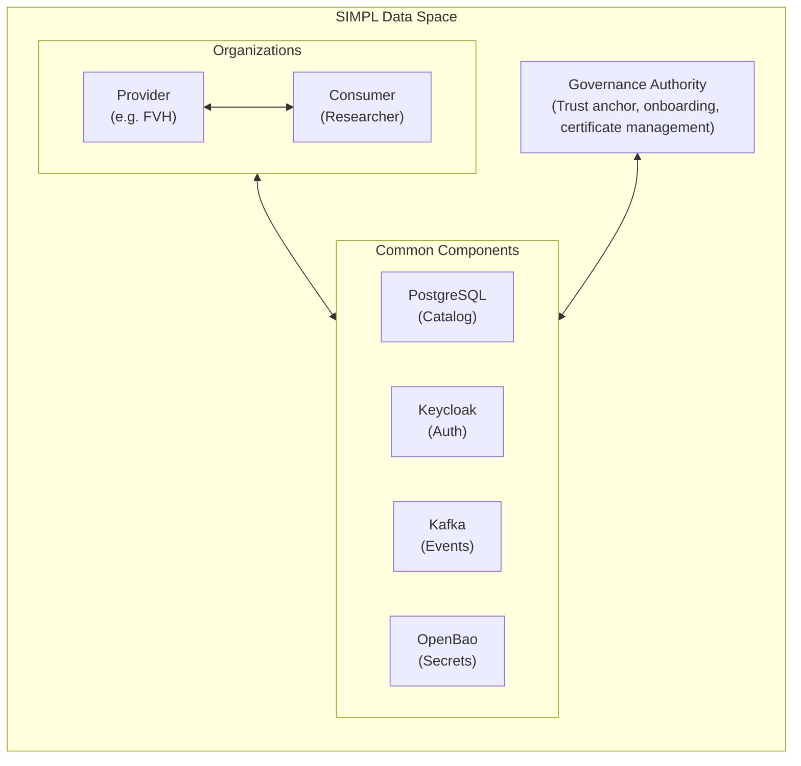
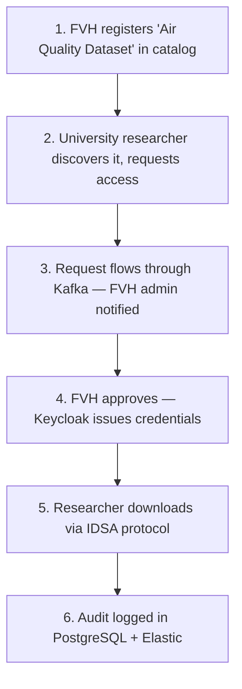

# What is SIMPL Open?

**SIMPL Open** is EU-developed open-source middleware for **secure, federated data sharing** between organizations. It implements [International Data Spaces (IDSA)](https://internationaldataspaces.org/) standards.

Think of it as a **standardized "data marketplace infrastructure"** where:
- Organizations retain **sovereignty** over their data
- **Usage policies** travel with data ("academic use only", "no redistribution")
- A **Governance Authority** manages trust between participants
- No single entity controls the data exchange

## Architecture Overview

## Component Roles

| Component | What it does |
|-----------|--------------|
| **PostgreSQL** | Stores data catalog (metadata), access policies, audit logs |
| **Keycloak** | User authentication, role-based access control |
| **Kafka** | Event streaming between components (access requests, notifications) |
| **OpenBao** | Secrets management (DB passwords, API keys, encryption) |
| **EJBCA** | Certificate Authority - issues X.509 certs for org identity |
| **Elastic Stack** | Logging, monitoring, compliance audits |
| **Governance Authority** | Trust management, onboarding, policy enforcement |

## What Would a Running Deployment Allow You To Do?

### As a Data Provider (e.g., FVH)

1. **Publish datasets** to a catalog with metadata
   - "Traffic sensor data, updated hourly, Helsinki region"

2. **Define usage policies**
   - "Academic research only"
   - "Must cite FVH in publications"
   - "No commercial redistribution"

3. **Receive & approve access requests**
   - Researcher requests access -> you approve/deny
   - They get time-limited credentials

4. **Track all data access**
   - Audit logs: "Org X downloaded 500MB at 14:32 UTC"
   - Revoke access if policies violated

### As a Data Consumer

1. **Discover datasets** from other organizations
2. **Request access** with justification
3. **Download data** using IDSA protocols
4. **Respect policies** (enforced automatically)

## What is a "Data Space"?

A **federated ecosystem** where multiple organizations exchange data using common standards - like email, but for data:

- **No central authority** owns the data
- **IDSA-compliant** connectors can interoperate
- **Policies travel with data** and are enforced
- **Trust is managed** by a Governance Authority

**EU Data Spaces emerging:**
- Mobility Data Space (traffic, transport)
- Smart Cities Data Space (urban sensors)
- Green Deal Data Space (climate, environment)

## Practical Example Flow

## Why Does This Matter?

| Benefit | Description |
|---------|-------------|
| **Data Sovereignty** | You control your data, not a cloud vendor |
| **Scalable Partnerships** | Support 20+ partners with one interface |
| **EU Compliance** | Ready for emerging EU data regulations |
| **No Vendor Lock-in** | Open source, IDSA standard |
| **Audit Trail** | Full compliance logging |

## Further Reading

- [SIMPL Programme](https://simpl-programme.ec.europa.eu/)
- [International Data Spaces Association](https://internationaldataspaces.org/)
- [EU Data Spaces](https://digital-strategy.ec.europa.eu/en/policies/data-spaces)
