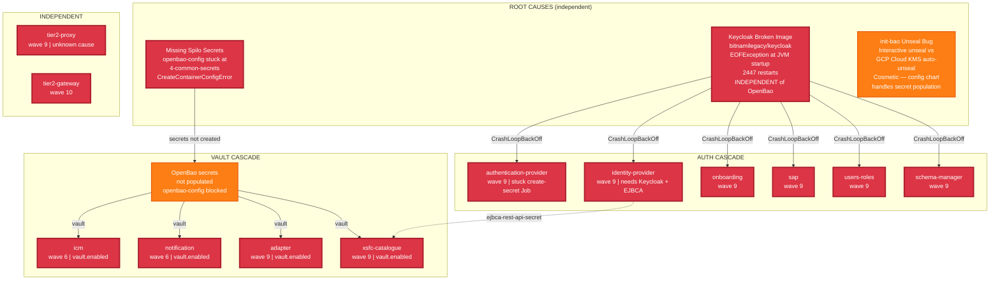

# SIMPL-Open Upstream Feedback

Strategy document for reporting deployment issues to the SIMPL-Open project on https://code.europa.eu/simpl.

---

## 0. Filing Log

**This section is the canonical per-item status.** The issue templates in §3 below
are preserved unchanged as the historical filing dossiers — where §3's framing
disagrees with a §0 status (e.g. A2's template still reads as an unfiled bug),
§0 wins. Legend: ✅ filed upstream · ❌ claim did not survive verification ·
⬜ no action needed (fixed upstream / superseded) · 🔵 new candidate, not yet filed.

Every candidate is **re-verified against upstream HEAD + latest tags and deduplicated
against the public trackers immediately before filing** — several long-held claims
in this document did not survive that check (marked ❌ below). Detailed per-wave
evidence is tracked internally.

| Wave | Date | Scope | Outcome |
|---|---|---|---|
| 1 | 2026-06-11 | 7 governance-config operator-flow findings ([findings doc](governance-config-operator-flow.md)) | 7 filed |
| 2 | 2026-06-11 | 17 consolidated candidates from this doc (A1–A7), the portability audit, and git history | 5 filed · 3 fixed-upstream · 1 obsolete · 1 duplicate-of-wave-1 · 7 claim-invalid |
| 3 | 2026-06-15 | A8 (sap `ephemeral-proof.issuer-url` placeholder) + A9 (tier1-gateway `jwt-configuration.primary.realm` move), both surfaced by the authority-iaa v1.2.23 post-sync validation | 2 filed (both re-verified present at the latest GA charts — sap v2.13.0, tier1-gateway v2.14.0 — and deduplicated against the projects' trackers first) |
| 4 | 2026-06-17 | A10 (kafka chart hardcodes `spec.configOverrides`, no log4j pass-through) + A11 (tier2-proxy logging) | 1 filed (A10, re-verified present at kafka v1.2.2) · 1 filed (A11 milder "default log level too verbose", re-verified present at tier2-proxy v1.6.2) · 1 fixed-upstream (A11 original "no log configurability" — logback config landed in tier2-proxy v1.6.0) |

Per-item status (Category A):

| # | Status |
|---|---|
| A1 | ✅ **Filed wave 2** ([common_components#33](https://code.europa.eu/simpl/simpl-open/development/agents/common_components/-/work_items/33)) — still 13 unguarded `range .Values.*.valueFiles` blocks at common_components v3.1.3 (`application.yaml`, `application-openbao.yaml`, `application-vswh.yaml`; `application-dependencies.yaml` no longer exists). governance-authority is no longer affected — its v3.x restructure dropped `valueFiles` entirely. |
| A2 | ❌ **Claim invalid** — simpl-fe 2.5.0 renders cleanly (`helm template` exit 0; chart byte-identical to 2.4.1 apart from version strings). The Feb 2026 ComparisonError was a values/configuration problem on our side, since remediated. |
| A3 | ✅ **Filed wave 2, reframed** ([tier1-gateway#1](https://code.europa.eu/simpl/simpl-open/development/iaa/tier1-gateway/-/work_items/1)) — `helm template` does NOT fail; the real defect is the chart default `ingress.issuer: ""` rendering an empty `cert-manager.io/cluster-issuer` annotation that the K8s API parses as nil (`<nil> is of the type <nil>`). Still present at tier1-gateway 2.14.0. |
| A4 | ✅ **Filed wave 2, reframed** ([common_components#34](https://code.europa.eu/simpl/simpl-open/development/agents/common_components/-/work_items/34)) — the `$values` reference only renders when a consumer sets `confluent_operator.valueFiles` (upstream never does), but `confluent_operator` remains the only component with a reference and no shipped `app-values/confluent-operator/` directory. |
| A5 | ❌ **Claim invalid** — the redpanda values (path is `app-values/redpanda/`, not `redpanda-console/`) have been v3-schema since common_components v2.4.0; console chart pin is 3.2.0. |
| A6 | ⬜ **Obsolete upstream** — upstream split the charts; the new openbao-init line (project 1347) never ships `secrets.yaml`, so the overlap no longer exists at current versions. ⚠️ FVH's vendored fork (`helm/openbao-…`) still carries the old flaw — tracked as a local cleanup task. **Local disposition (2026-06-23, tasks 193/194):** verified both forks against upstream before any retirement. **openbao-init** — 1.1.0 confirms `secrets.yaml` is gone, but it reverts auto-unseal to Shamir keys-in-a-K8s-secret (no GCP KMS), so the fork is *kept* and instead has its own `secrets.yaml` dropped — eliminating the 9 duplicate Secrets while preserving GCP KMS auto-unseal. **openbao-config** — retirement to 1.3.6 *blocked*: upstream carries the kubernetes_host fix but not this fork's Job `Replace=true,Force=true` annotation (its Job has no templated annotations block, so not valuesObject-exposable) and has diverged substantially (new dagster engine, OpenID-issuer initContainer, imageTag param, new secret writes); fork retained. |
| A7 | ✅ **Fixed upstream, GA** — the hook fix shipped in authentication-provider **v2.16.0 (2026-06-09)**; authority-iaa v1.5.0/v1.5.1 pin it. The release line jumped 2.12.5 → 2.16.0 (the 2.13/2.14-rc tracks never went GA). Tracking closed; resolves the cosmetic Missing on adoption. |
| A8 | ✅ **Filed wave 3 (2026-06-15)** ([security-attributes-provider#1](https://code.europa.eu/simpl/simpl-open/development/iaa/security-attributes-provider/-/work_items/1)) — sap binds `simpl.ephemeral-proof.issuer-url` as `@NotNull URI`, but the chart default is the SIMPL-pipeline placeholder `[SIMPL_EPHEMERAL_PROOF_ISSUER_URL]` (and `values-test.yaml` doesn't set it). Any non-pipeline deployer gets a null bind → `APPLICATION FAILED TO START`. **Re-verified present at the latest GA chart v2.13.0** before filing; no pre-existing sap work item. Surfaced by post-sync validation; fixed in our deployment. |
| A9 | ✅ **Filed wave 3 (2026-06-15)** ([tier1-gateway#2](https://code.europa.eu/simpl/simpl-open/development/iaa/tier1-gateway/-/work_items/2)) — tier1-gateway binds `jwt-configuration.primary.realm` as `@NotBlank`, but the realm config moved off the old `keycloak.app.realm` path (silently dead at 2.12.x+) and is shipped only as a commented `<your-realm-name>` example with no migration note. Plain-Helm deployers crash-loop with no chart-surfaced guidance. **Re-verified present at the latest GA chart v2.14.0** before filing (the only pre-existing work item, #1, is the unrelated A3 `ingress.issuer` defect). Surfaced by post-sync validation; fixed in our deployment. |
| A10 | ✅ **Filed wave 4 (2026-06-17)** ([kafka#2](https://code.europa.eu/simpl/simpl-open/development/common-components/kafka/-/work_items/2)) — the kafka chart hardcodes the `Kafka` CR `spec.configOverrides` (`jvm` + `server` only) with **no values pass-through**, so a deployer cannot set broker `log4j` levels via Helm. **Re-verified present at the latest GA chart v1.2.2** (`charts/templates/kafka.yaml`; `charts/values.yaml` has no `configOverrides` key; `kraftController.yaml` shares the shape). Dedup: project 976 has zero issues. Concrete impact: an expired Confluent enterprise license drives a ~1/sec `LicenseManager` AdminClient retry loop logging the full broker config at INFO (~tens of GiB/day) with no chart-exposed throttle. **Follow-up (2026-06-17):** deploying the fix showed the working override field is `configOverrides.log4j2` (structured), not `configOverrides.log4j` (log4j1 array, inert under `USE_LOG4J2=true`) — a clarifying note was added to kafka#2; the chart pass-through should target `log4j2`. FVH applied it live (guarded by an ArgoCD `ignoreDifferences`; durable chart fork tracked internally). |
| A11 | ✅ **Filed wave 4 (2026-06-17)** ([tier2-proxy#4](https://code.europa.eu/simpl/simpl-open/development/iaa/tier2-proxy/-/work_items/4)) — *milder, separate defect.* tier2-proxy `src/main/resources/logback.xml` defaults the app's own `eu.europa.ec.simpl` logger to **DEBUG** (`LOG_LEVEL_SIMPL:-DEBUG`), while root/kafka/netty default to INFO/WARN/WARN — so per-connection proxy DEBUG spam is on by default. Deployers can override via `extraEnv` (hence milder). **Re-verified present at the latest GA image v1.6.2.** Dedup: project 1112's only issue (#2, closed) is unrelated. ⬜ **The original A11 claim — "no log configurability at all" (v1.5.5 shipped no `logback.xml`, fell back to BasicConfigurator root=DEBUG) — is FIXED UPSTREAM**: tier2-proxy **v1.6.0** added `logback.xml` with `LOG_LEVEL_ROOT/SIMPL/KAFKA/NETTY` env knobs (still present at v1.6.2). Not filed. |

Categories B/C were deliberately **not** auto-filed (they propose FVH contributions and
cross-cutting design changes that need human framing). Status: B1/B2/C1 were
substantially addressed by upstream's v3.1.0 `ARGOCD_DEPLOYMENT.md` (external ArgoCD
as a first-class pattern); B3/B4/C2/C3/C4 remain open contribution opportunities.

### Third-party chart candidates (non-`code.europa.eu`)

These arose from third-party charts SIMPL-Open pulls in (not SIMPL's own repos),
so they would be filed on those projects' own trackers, not on `code.europa.eu/simpl`.
Same verify-at-HEAD + dedup bar as the Category-A waves.

| # | Chart | Status |
|---|---|---|
| T1 | `codecentric/keycloakx` (KC `cache.stack`/`jdbc-ping`) | ⬜ **No action needed — claim does not survive as a fileable chart defect.** The chart hardcodes `KC_CACHE=ispn` + `KC_CACHE_STACK=jdbc-ping` when `cache.stack` is left at its `default` value, and **still does so at chart HEAD 7.2.0** (verified `helm template` 2026-06-23). But this is *correct*: per [codecentric/helm-charts#856](https://github.com/codecentric/helm-charts/pull/856) (merged 2025-09-08), the chart default deliberately tracks **Keycloak 26.1.0+, where `jdbc-ping` became the platform default stack**. The chart's own default image is KC 26.x (26.5.3 in 7.1.8, 26.6.2 in 7.2.0), so the shipped pairing starts cleanly. Our ISPN000540 came **only** from FVH overriding the image down to `quay.io/keycloak/keycloak:25.0.6` — where `jdbc-ping` is not a bundled JGroups stack — against a chart whose cache default assumes KC ≥ 26.1. That is an FVH image-pin choice, not a chart bug, and the chart already ships the documented escape hatch (`cache.stack: custom`, which we set). Dedup: no `ISPN000540` / `jdbc-ping`-vs-KC25 issue on the tracker (closest is PR #856, the change itself). **Nothing to file**; the `cache.stack: custom` override stays (correct for our single-replica eval KC 25). |
| T2 | `jouve/charts` mailpit (`ingress.className`) | ⬜ **No action needed** — was our values bug (`className` vs the chart's `ingress.ingressClassName`), fixed in our deployment; not an upstream defect. |

---

## 1. Introduction & Deployment Context

### Our Setup

Forum Virium Helsinki deployed the SIMPL-Open evaluation environment on Google Cloud using:

- **Cluster**: GKE Standard (remote, dedicated, regional)
- **GitOps**: Existing ArgoCD instance on a management cluster, connected via GKE Hub fleet membership + Connect Gateway
- **Secrets**: OpenBao with GCP KMS auto-unseal, Workload Identity Federation
- **Database**: Cloud SQL PostgreSQL (replacing Zalando Spilo)

### Why External ArgoCD

The documented SIMPL-Open deployment bundles its own ArgoCD instance on the target cluster. We chose not to follow that approach because:

1. We already run ArgoCD managing all our GitOps deployments
2. A second ArgoCD means duplicated RBAC, authentication, monitoring, and maintenance
3. We wanted SIMPL-Open visible alongside our other applications in a single pane of glass

This is a legitimate deployment pattern — organizations with existing GitOps infrastructure should not need to run a second ArgoCD.

### Scale

- ~30 ArgoCD Applications across 2 namespaces (`simpl-eval-common`, `simpl-eval-governance`)
- 25+ Helm chart repositories from `code.europa.eu` and third-party sources
- 55 commits over 5 weeks (Jan 14 – Feb 16, 2026), roughly 20% of total workload

### Evidence Base

| Document | Contents |
|----------|----------|
| §3 A1 below | Complete bug report for A1 (valueFiles null) |
| Dependency-cascade diagram (embedded in [§B4](#b4-no-cascading-failure-documentation-or-mitigation) below) | Mermaid diagram of cascading failures (Feb 2026 snapshot) |
| [deployment-retrospective.md](deployment-retrospective.md) | Full deployment narrative with lessons |
| [deployment-timeline.md](../overview/deployment-timeline.md) | Chronological deployment account compiled from git history |
| [governance-config-operator-flow.md](governance-config-operator-flow.md) | Post-deploy governance configuration flow findings (Jun 2026) — candidate upstream feedback on the operator flow |
| `containers/argocd-cmp/internal/cmp/cmp.go` | CMP plugin source (placeholder substitution + Application CR filtering) |
| `argocd/apps/values.yaml:108-920` | All nested app configs with inline workaround comments |
| `argocd/apps/templates/simpl-eval/simpl-open.yaml` | Recreated nested apps template |

---

## 2. Issue Categories

### Category A: Chart Bugs

Issues that break deployment regardless of ArgoCD setup. These affect the happy path too.

| # | Issue | Affected Repo | Priority | Happy-path? |
|---|-------|---------------|----------|-------------|
| A1 | `valueFiles: null` from empty range loops | common_components, governance-authority | HIGH | YES |
| A2 | governance-frontend v2.5.0 template rendering error | governance-authority (project 769) | HIGH | YES |
| A3 | tier1-gateway v2.5.0 template rendering error | governance-authority (project 772) | HIGH | YES |
| A4 | Missing `app-values/confluent-operator/values.yaml` in v2.4.2 | common_components | HIGH | Unclear |
| A5 | Redpanda Console values incompatible with chart v3.x | common_components | MEDIUM | Likely YES |
| A6 | openbao-init and openbao-config generate duplicate Secrets | openbao-init-config (project 1258) | HIGH | YES |
| A7 | authentication-provider create-secret Job uses `randAlphaNum` suffix → perpetual ArgoCD Missing / auto-heal loop | authentication-provider (project 939) | MEDIUM | NO (ArgoCD-only) |
| A8 | sap 2.12.4 `simpl.ephemeral-proof.issuer-url` (`@NotNull URI`) defaults to the unsubstituted pipeline placeholder `[SIMPL_EPHEMERAL_PROOF_ISSUER_URL]` → null bind crash for non-pipeline deployers | security-attributes-provider (project 861) | HIGH | YES |
| A9 | tier1-gateway 2.12.6 `jwt-configuration.primary.realm` (`@NotBlank`) required but shipped only as a commented example; realm moved off `keycloak.app.realm` with no migration note | tier1-gateway (project 772) | HIGH | YES |
| A10 | kafka chart hardcodes `Kafka` CR `spec.configOverrides` (`jvm`+`server` only); no values pass-through for `log4j`/broker config → broker log levels unsettable via Helm | kafka (project 976) | MEDIUM | YES |
| A11 | tier2-proxy `logback.xml` defaults app logger `eu.europa.ec.simpl` to DEBUG → per-connection proxy spam by default (milder; overridable via env) | tier2-proxy (project 1112) | LOW | YES |

### Category B: Architecture Improvements

Design decisions that reduce portability. Framed as enhancement proposals.

| # | Issue | Priority |
|---|-------|----------|
| B1 | `${VARIABLE}` placeholders instead of standard Helm `.Values` | HIGH |
| B2 | Nested Application CRDs embedded in umbrella chart output | HIGH |
| B3 | Tight coupling to Zalando Spilo PostgreSQL operator | MEDIUM |
| B4 | No cascading failure documentation or mitigation | MEDIUM |

### Category C: Documentation Gaps

Things we had to discover through trial and error.

| # | Issue | Priority |
|---|-------|----------|
| C1 | No documentation for external ArgoCD deployment | HIGH |
| C2 | No component dependency graph | MEDIUM |
| C3 | Confluent CRD ServerSideApply requirement undocumented | MEDIUM |
| C4 | Chart repository URLs not centrally listed | LOW |

---

## 3. Issue Templates

### A1: `valueFiles: null` from empty range loops

**Target**: https://code.europa.eu/simpl/simpl-open/development/agents/common_components / governance-authority

**Title**: `Bug: valueFiles renders as null when range loop produces no output`

**Description**:
ArgoCD Application templates use `range .Values.*.valueFiles` to populate the `valueFiles` field. When the iterable is empty or undefined, the range produces no output, leaving `valueFiles:` with no value. Kubernetes interprets this as `valueFiles: null`, which fails validation:

```
Error: Application.argoproj.io "common-local" is invalid:
spec.sources[1].helm.valueFiles: Invalid value: "null":
spec.sources[1].helm.valueFiles in body must be of type array: "null"
```

**Affected files**:
- `common_components/charts/templates/application-dependencies.yaml` (lines 28-31, 54-57)
- `common_components/charts/templates/application.yaml`
- `governance-authority/charts/templates/application.yaml`

**Reproduction**: Deploy with any component that has an empty `valueFiles` array.

**Proposed fix**: Wrap the `valueFiles` block in a conditional:

```yaml
# Before (broken)
helm:
  valueFiles:
    {{- range .Values.vault_webhook.valueFiles }}
    - $values/app-values/vault-webhook/{{ . }}
    {{- end }}

# After (fixed)
helm:
  {{- if .Values.vault_webhook.valueFiles }}
  valueFiles:
    {{- range .Values.vault_webhook.valueFiles }}
    - $values/app-values/vault-webhook/{{ . }}
    {{- end }}
  {{- end }}
```

**Impact**: HIGH — blocks deployment entirely. Affects both bundled and external ArgoCD.

**Workaround**: We automated a patch script (`scripts/patch-argocd-valuefiles.py`) that applies the conditional wrapping. See full report for details.

---

### A2: governance-frontend v2.5.0 template rendering error

**Target**: https://code.europa.eu/simpl/simpl-open/development/agents/governance-authority (project 769 — `simpl-fe` chart)

**Title**: `Bug: simpl-fe chart v2.5.0 fails helm template rendering`

**Description**:
The `simpl-fe` (governance-frontend) Helm chart at version 2.5.0 fails during `helm template` rendering. ArgoCD cannot generate manifests for this chart version, resulting in a `ComparisonError` that prevents sync entirely.

**Reproduction**:

```bash
helm repo add simpl-fe https://code.europa.eu/api/v4/projects/769/packages/helm/stable
helm template test simpl-fe/simpl-fe --version 2.5.0
```

**Impact**: HIGH — the chart cannot be deployed at this version. We are currently deploying via the CMP plugin with the governance-authority umbrella chart at v2.4.1, where frontend rendering works.

**Workaround**: Pin governance-authority to v2.4.1 (the parent chart that includes `simpl-fe`), avoiding the standalone v2.5.0 chart. Our CMP-processed deployment at `argocd/apps/templates/simpl-eval/simpl-open.yaml:228-314` uses this pinned version.

**Proposed solution**: Fix the template rendering error in `simpl-fe` v2.5.x and publish a corrected chart version.

---

### A3: tier1-gateway v2.5.0 template rendering error

**Target**: https://code.europa.eu/simpl/simpl-open/development/agents/governance-authority (project 772 — `tier1-gateway` chart)

**Title**: `Bug: tier1-gateway chart v2.5.0 fails helm template rendering`

**Description**:
The `tier1-gateway` Helm chart at version 2.5.0 fails during `helm template` rendering. ArgoCD reports a `ComparisonError` that blocks sync.

**Reproduction**:

```bash
helm repo add tier1-gateway https://code.europa.eu/api/v4/projects/772/packages/helm/stable
helm template test tier1-gateway/tier1-gateway --version 2.5.0
```

**Impact**: HIGH — the chart cannot be deployed at this version. We deploy it as a standalone nested app at `argocd/apps/values.yaml:811-844` but the template bug means ArgoCD cannot render manifests.

**Workaround**: No clean workaround for standalone deployment. The chart requires an upstream fix. For the umbrella chart path, pinning to v2.4.1 avoids the issue.

**Proposed solution**: Fix the template rendering error and publish a corrected chart version.

---

### A4: Missing `app-values/confluent-operator/values.yaml` in v2.4.2

**Target**: https://code.europa.eu/simpl/simpl-open/development/agents/common_components

**Title**: `Bug: app-values/confluent-operator/values.yaml missing from v2.4.2 release`

**Description**:
The `common_components` chart at v2.4.2 references `app-values/confluent-operator/values.yaml` in its ArgoCD Application template, but this file does not exist in the repository at that tag. When ArgoCD attempts to use this as a multi-source `$values` reference, it fails with a `ComparisonError` that blocks the entire Confluent Operator deployment.

This is a cascading failure: without Confluent Operator, Confluent CRDs cannot be installed, Kafka cannot start, and all 6+ Kafka-dependent services fail.

**Evidence** (from `argocd/apps/values.yaml:281-297`):

```yaml
# NOTE: valuesRef removed — app-values/confluent-operator/values.yaml does
# not exist in common_components.git v2.4.2, causing a ComparisonError that
# blocks CRD installation and cascades to Kafka + 6 downstream apps.
```

**Workaround**: Remove the `valuesRef` and `valueFiles` entirely. Provide all necessary values inline via `valuesObject`:

```yaml
valuesObject:
  fullnameOverride: confluent-for-kubernetes
  kRaftEnabled: true
```

**Proposed solution**: Either add the missing values file to the repository, or remove the reference from the Application template if the file was never intended to exist at this version.

---

### A5: Redpanda Console values incompatible with chart v3.x

**Target**: https://code.europa.eu/simpl/simpl-open/development/agents/common_components

**Title**: `Bug: Upstream Redpanda Console values incompatible with console chart v3.x schema`

**Description**:
The `common_components` chart references Redpanda Console values that are structured for the chart v2.x schema. When deploying with the Redpanda `console` chart at v3.x, these upstream values cause schema validation failures.

**Evidence** (from `argocd/apps/values.yaml:327-333`):

```yaml
# valuesRef removed — upstream values conflict with chart v3.x schema
```

**Workaround**: Remove the upstream `valuesRef` and provide compatible values inline via `valuesObject`.

**Proposed solution**: Update the `app-values/redpanda-console/` values in `common_components` to match the current Redpanda `console` chart schema (v3.x).

---

### A6: openbao-init and openbao-config generate duplicate Secrets

**Target**: https://code.europa.eu/simpl/simpl-open/development/agents — project 1258 (openbao-init-config)

**Title**: `Bug: openbao-init and openbao-config charts both render the same 9 Secrets, causing OutOfSync flapping`

**Description**:
Both the `openbao-init` chart (sync wave 2) and `openbao-config` chart (sync wave 3) render the same set of 9 Kubernetes Secrets (ejbca-secret, gitea-secrets, kafka-users-secret, keycloak-secrets, mailpit-secrets, pg-admin-secret, redis-secrets, redpanda-secret, schema-manager-secret). When ArgoCD manages both as separate Applications:

1. `openbao-init` creates the Secrets with an incomplete subset of data
2. `openbao-config` overwrites them with complete data (including governance entries)
3. ArgoCD detects the difference and reports both as OutOfSync
4. Auto-heal triggers mutual overwrites, causing continuous flapping
5. Both apps show 41+ `autoHealAttempts` and remain stuck in `Progressing`

This affects the **happy path** deployment too — the bundled ArgoCD would experience the same flapping.

**Evidence** (from `argocd/apps/values.yaml:196-237`):

```yaml
# openbao-config is the authoritative owner of these 9 secrets (renders
# complete data including governance entries). openbao-init renders an
# incomplete subset. Ignore differences to prevent mutual OutOfSync flapping.
ignoreDifferences:
  - group: ""
    kind: Secret
    name: ejbca-secret
    jsonPointers: ["/data", "/metadata/annotations"]
  # ... 8 more secrets ...
```

**Workaround**: Add `ignoreDifferences` for all 9 Secrets on the `openbao-init` Application, treating `openbao-config` as the authoritative owner.

**Proposed solution**: Either:
1. Remove Secret rendering from `openbao-init` (let `openbao-config` be the sole owner), or
2. Merge the two charts into a single chart with init and config as separate Helm hooks, or
3. Add an ownership annotation so ArgoCD can determine which app owns each Secret

---

### A7: authentication-provider create-secret Job uses `randAlphaNum` suffix, causing perpetual ArgoCD Missing / auto-heal loop

**Target**: https://code.europa.eu/simpl/simpl-open/development/agents/iaa/authentication-provider (project 939 — `authentication-provider` chart)

**Title**: `Bug: db-cipher-secret Job name uses randAlphaNum suffix, causing ArgoCD perpetual Missing/auto-heal loop`

**Status (verified 2026-05-25)**: **Already fixed upstream — pending backport to a GA-shipped umbrella release.** Bisect across the public chart-registry index pinpoints the fix landing between `2.14.0-SNAPSHOT.2033.23f3db06` (2026-04-08, no hook) and `2.14.0-SNAPSHOT.2066.b5b0147f` (2026-04-20, hook present). The fix is in every snapshot/rc from `2.14.0-SNAPSHOT.2066+` and `2.14.0-rc.latest`. The chart-registry index also shows an upstream feature branch named `2.13.0-F-feature-test-alter-job` producing builds in early April — strong evidence upstream noticed this themselves. **No GA release contains the fix yet** (latest GA-shape is `2.13.0-rc.*`).

**Umbrella tracking** (authenticated `code.europa.eu` walk on 2026-05-25): `governance-authority v3.1.0` (released 2026-05-20) ships `authority-iaa v1.2.17`, which pins `authentication-provider 2.12.4` → **does NOT include the hook fix**. The fix is in `authority-iaa v1.4.3` (`auth-provider 2.14.0-rc.2130`), but `v1.4.x` is not pinned by any released `governance-authority` umbrella. Upstream maintains three parallel `authority-iaa` tracks (`v1.2.x` stable, `v1.3.x`, `v1.4.x` development). Adopting `governance-authority v3.1.0` does NOT resolve the cosmetic Missing — that needs either a future `governance-authority v3.2+` adopting `authority-iaa v1.4.x`, or an FVH-side independent bump of `authentication-provider`.

Filing upstream is therefore unnecessary; the open question is when the fix lands in a `governance-authority` release. The A7 record below is preserved for traceability and for the GA-backport tracking.

**Upstream fix shape** (from `authentication-provider-2.14.0-rc.latest/templates/db-cipher-secret-job.yaml`):

```yaml
metadata:
  name: {{ .Chart.Name }}-create-secret-{{ randAlphaNum 6 | lower }}   # name shape unchanged
  annotations:
    argocd.argoproj.io/hook: Sync                                       # NEW
    argocd.argoproj.io/hook-delete-policy: HookSucceeded                # NEW
  labels:
    ...
spec:
  ttlSecondsAfterFinished: 300                                          # NEW (belt-and-braces)
```

Upstream kept the random-name shape but converted it to an ArgoCD-side hook (functionally equivalent to the Helm-hook approach proposed below — both remove the Job from ArgoCD's continuously-managed resource set). Either path resolves the symptom.

**Description**:
The `authentication-provider` chart renders an init-style Job that creates a database cipher Secret. The Job name template uses `randAlphaNum` so a fresh random suffix is generated on every Helm render:

```yaml
# authentication-provider@2.8.0/templates/db-cipher-secret-job.yaml:4
apiVersion: batch/v1
kind: Job
metadata:
  name: {{ .Chart.Name }}-create-secret-{{ randAlphaNum 6 | lower }}
```

The Job's body is idempotent — it checks if the cipher Secret already exists and skips creation if so:

```yaml
command:
  - /bin/sh
  - -c
  - |
    if [ -f /etc/alpine-release ]; then apk add openssl; fi
    if ! kubectl get secret {{ .Values.db.cipherSecret }}; then
      echo "Creating secret..."
      kubectl create secret generic {{ .Values.db.cipherSecret }} --from-literal=aes-key=$(openssl rand -base64 32)
    else
      echo "Secret already exists"
    fi
```

But the Job is rendered as a **regular managed resource** — there is no `helm.sh/hook` / `argocd.argoproj.io/hook` annotation. As a result, ArgoCD treats every newly-named Job as a desired-state resource and tries to reconcile it. Because every render produces a different name, the previously-applied Job is no longer in desired state and ArgoCD reports `Health: Missing`, `Sync: OutOfSync` for the Application even when the underlying Deployment + Secret + Service are all Synced and Healthy.

With `selfHeal: true` enabled (the typical default), ArgoCD then enters an unbounded loop:

1. Render produces Job named `…create-secret-zc43bo`
2. ArgoCD sees Missing, self-heals → applies the Job
3. Job's `if ! kubectl get secret …` evaluates true → exits "Secret already exists"
4. Job completes, TTL controller (or Kubernetes Job GC) prunes it
5. Next reconcile renders `…create-secret-1aw2av` (different suffix), back to step 1

We observe `autoHealAttemptsCount: 1210` and climbing on this Application. The cluster-side workload is Healthy throughout — this is pure ArgoCD-side reconciliation churn.

**Reproduction**:

```bash
helm template test \
  --repo https://code.europa.eu/api/v4/projects/939/packages/helm/stable \
  authentication-provider --version 2.8.0 \
  | grep "name: authentication-provider-create-secret"
# Run twice — observe a different suffix each time.
```

Deploy via any ArgoCD with `syncPolicy.automated.selfHeal: true` and watch `autoHealAttemptsCount` climb in `argocd app get <app>` over minutes.

**Impact**: MEDIUM
- No functional impact — the Deployment is Healthy, the Secret is present after the first successful run
- Operational impact — the Application stays in `Health: Missing` permanently, masking real failures and creating false-positive alerts
- Resource impact — ArgoCD spends continuous reconcile cycles on a no-op Job; we logged 1200+ heal attempts before flagging this
- Observability impact — ArgoCD's `lastTransitionTime` becomes unreliable as a divergence signal, because the timestamp flips on every heal cycle

**Workaround**: Set `syncPolicy.automated.selfHeal: false` on the Application (cost: real divergences need manual sync), or accept the cosmetic Missing status and add ignore-list rules in dashboards.

**Proposed solution**: Convert the Job to a Helm pre-install/pre-upgrade hook with a deterministic name and self-deleting policy:

```yaml
apiVersion: batch/v1
kind: Job
metadata:
  name: {{ .Chart.Name }}-create-secret
  annotations:
    helm.sh/hook: pre-install,pre-upgrade
    helm.sh/hook-delete-policy: before-hook-creation,hook-succeeded
    helm.sh/hook-weight: "-5"
```

This makes the Job a true install-time operation: it runs once per Helm release, deletes itself after success, and is **not** rendered into ArgoCD's continuously-managed resource set. ArgoCD will never see Missing on a no-longer-existing hook Job.

Alternative (less clean): keep the regular-resource shape but use a deterministic name (e.g., `{{ .Chart.Name }}-create-secret`) and add `argocd.argoproj.io/sync-options: Replace=true` so re-application doesn't trip immutable-field errors. This still leaves the Job permanently in ArgoCD's resource tree but at a stable name that doesn't keep flipping to Missing.

**Related upstream patterns**: the same `randAlphaNum`-suffix shape may exist in other charts that pre-seed Secrets — worth a sweep across `iaa/*` charts.

---

### A8: sap `simpl.ephemeral-proof.issuer-url` defaults to an unsubstituted pipeline placeholder

**Target**: https://code.europa.eu/simpl/simpl-open/development/iaa/security-attributes-provider (project 861)

**Affected version**: chart/image `2.12.4` (authority-iaa v1.2.23). Introduced when the image made `simpl.ephemeral-proof.issuer-url` a required field.

**Symptom**: the pod fails to start —

```
Binding to target ...SimplProperties failed:
    Property: simpl.ephemeralProof.issuerUrl
    Value: "null"
    Reason: must not be null
APPLICATION FAILED TO START
```

**Root cause**: `SimplProperties.EphemeralProof.issuerUrl` is `@NotNull URI`, but the chart `values.yaml` default is the literal SIMPL-pipeline placeholder `appConfig.simpl.ephemeral-proof.issuer-url: [SIMPL_EPHEMERAL_PROOF_ISSUER_URL]`. Deployers who run the EC GitLab CI pipeline get it substituted; anyone deploying the published chart directly (plain Helm / ArgoCD) does not, so it binds null. `app-values/SAP/values.yaml` and `values-test.yaml` don't set it either, so there is no working reference value in the repo.

**Impact**: HIGH, happy-path — blocks any non-pipeline deployment of sap 2.12.x.

**Proposed solution**: ship a real default (e.g. the SAP service's external base URL) or document the required override in `values.yaml`; at minimum set it in `values-test.yaml` so `helm test` exercises a non-null value. The field is the `iss` claim on issued ephemeral proofs (no JWKS/discovery fetch), so any stable canonical URI works.

**FVH workaround**: `appConfig.simpl.ephemeral-proof.issuer-url: https://governance.simpl-eval.tfds.io/sapApi/v1`.

---

### A9: tier1-gateway `jwt-configuration.primary.realm` required but shipped only as a comment

**Target**: https://code.europa.eu/simpl/simpl-open/development/iaa/tier1-gateway (project 772)

**Affected version**: chart/image `2.12.6` (authority-iaa v1.2.23).

**Symptom**:

```
Binding to target ...JwtProperties$PrimaryJwtProperties failed:
    Property: jwt-configuration.primary.realm
    Value: "null"
    Reason: must not be blank
APPLICATION FAILED TO START
```

**Root cause**: between 2.8.0 and 2.12.6 the realm configuration moved from `appConfig.keycloak.app.realm` to `appConfig.jwt-configuration.primary.realm` (`@NotBlank`, plus `applicant.realm` for authority deployments). The old key still exists in the v3.0.4 `app-values/tier1-gateway/values.yaml` (so it reads as configured) but is silently ignored at 2.12.6, and the new key appears in the chart `values.yaml` only as a commented `<your-realm-name>` example. No migration note flags the move, so an upgrader carrying forward working 2.8.0 values crash-loops with no chart-surfaced guidance.

**Impact**: HIGH, happy-path — blocks any tier1-gateway 2.12.x upgrade that reuses pre-2.12 realm config.

**Proposed solution**: either keep reading `keycloak.app.realm` as a fallback, ship an active default, or add an explicit upgrade note documenting the `keycloak.app.realm → jwt-configuration.primary.realm` move.

**FVH workaround**: `appConfig.jwt-configuration.primary.realm: authority` + `applicant.realm: authority`.

---

### A10: kafka chart hardcodes `spec.configOverrides` — no log4j / configOverrides pass-through

**Target**: https://code.europa.eu/simpl/simpl-open/development/common-components/kafka (project 976)

**Affected version**: chart `v1.2.2` (latest GA tag; FVH pin `v1.2.0`). Re-verified present at v1.2.2 before filing.

**Filed**: wave 4, 2026-06-17 — [kafka#2](https://code.europa.eu/simpl/simpl-open/development/common-components/kafka/-/work_items/2). Dedup: project 976's issue tracker is empty (no pre-existing equivalent).

**Symptom**: a deployer using the published chart cannot set Kafka broker log levels (the `log4j` config of the Confluent `cp-server` broker), nor override any other broker `configOverrides` entry, through Helm values. A `valuesObject`/`values.yaml` `configOverrides.log4j` (or any `configOverrides` key) is silently ignored.

**Root cause**: `charts/templates/kafka.yaml` writes the `Kafka` CR `spec.configOverrides` as a static block containing only `jvm` and `server` lists, all driven by fixed `.Values.kafka.topic.*` keys. `charts/values.yaml` has no `configOverrides` key at all, so there is no pass-through — nothing in the template reads a deployer-supplied `log4j` (or arbitrary `configOverrides`) list. `kraftController.yaml` has the same hardcoded shape.

**Impact**: MEDIUM, happy-path. The `cp-server` broker logs at INFO by default and can flood logs with no operator-accessible throttle. Concrete case FVH hit: an **expired Confluent enterprise license** puts the broker's `LicenseManager` into a ~1/sec `AdminClient` retry loop, each iteration dumping the broker's full (~90-line) config at INFO — on the order of tens of GiB/day. The standard Confluent remedy is a `log4j` override (raise `io.confluent.license`/`LicenseManager` to WARN), which this chart gives no way to apply. The only remedies for a plain-Helm/GitOps consumer are forking the chart or imperatively patching the live `Kafka` CR (which then drifts on the next sync). FVH log-volume impact tracked internally.

**Proposed solution**: expose `configOverrides` through chart values and merge it into the rendered `Kafka` CR `spec.configOverrides`, keeping the existing `jvm`/`server` defaults but appending values-driven entries. **Important refinement (added to kafka#2 as a follow-up note 2026-06-17):** the broker runs **log4j2** (`USE_LOG4J2=true`, cp-server 8.x), so the field that actually reaches the active config is **`configOverrides.log4j2`** (a structured object CFK merges into `log4j2.yaml`, per-logger levels under `Configuration.Loggers.Logger`) — NOT the `configOverrides.log4j` array, which CFK writes to a `log4j.properties` the log4j2 broker never reads. The chart should expose `configOverrides.log4j2` (or pass through arbitrary `configOverrides` keys); exposing only `log4j` would surface an inert field on CP 7.x+.

**FVH workaround**: interim relief applied by patching the live `Kafka` CR's `spec.configOverrides.log4j2` (`AbstractConfig`/`AppInfoParser`=WARN, `LicenseManager`=ERROR), guarded by an ArgoCD `ignoreDifferences` on `.spec.configOverrides.log4j2` so selfHeal doesn't revert it. Verified on cp-server 8.0.1: the override landed in the broker's live `log4j2.yaml` and the storm stopped. (`configOverrides.log4j` was tried first and confirmed inert — the log4j-vs-log4j2 distinction above.) Durable chart fork tracked internally.

---

### A11: tier2-proxy default log level too verbose (`LOG_LEVEL_SIMPL` defaults to DEBUG)

**Target**: https://code.europa.eu/simpl/simpl-open/development/iaa/tier2-proxy (project 1112)

**Affected version**: image/chart `v1.6.2` (latest GA tag; FVH pin `v1.5.5`). The DEBUG default has been present since v1.6.0.

**Filed**: wave 4, 2026-06-17 — [tier2-proxy#4](https://code.europa.eu/simpl/simpl-open/development/iaa/tier2-proxy/-/work_items/4) (the milder verbose-by-default defect). Dedup: project 1112's only issue (#2, closed, "tier2-proxy Degraded") is unrelated.

**Fixed-upstream history (the original A11 claim, NOT filed)**: up to and including **v1.5.5** the image shipped **no `logback.xml`**, so logback fell back to `BasicConfigurator` at root=DEBUG and log levels were not configurable at all (neither Spring `logging.level.*` — the app is plain Netty + logback-classic, not Spring Boot — nor any env). **v1.6.0 fixed this** by adding `src/main/resources/logback.xml` with `LOG_LEVEL_ROOT`/`LOG_LEVEL_SIMPL`/`LOG_LEVEL_KAFKA`/`LOG_LEVEL_NETTY` env knobs (still present at v1.6.2). So the "no log configurability" defect is ⬜ fixed upstream and was not filed.

**Symptom (milder, still present at v1.6.2)**: a default deployment logs a DEBUG line for every connection and every TCP health-check probe (e.g. from the proxy's `HttpProxyHandler`) — verbose-by-default for a production-shaped chart.

**Root cause**: in `src/main/resources/logback.xml`, the app's own package logger defaults to DEBUG while everything else defaults sensibly:

```xml
<property name="ROOT_LEVEL"  value="${LOG_LEVEL_ROOT:-INFO}"/>
<property name="SIMPL_LEVEL" value="${LOG_LEVEL_SIMPL:-DEBUG}"/>   <!-- app package defaults to DEBUG -->
<property name="KAFKA_LEVEL" value="${LOG_LEVEL_KAFKA:-WARN}"/>
<property name="NETTY_LEVEL" value="${LOG_LEVEL_NETTY:-WARN}"/>
<logger name="eu.europa.ec.simpl" level="${SIMPL_LEVEL}"/>
```

**Impact**: LOW. Overridable — a deployer can set `LOG_LEVEL_SIMPL=INFO` (e.g. via the chart's `extraEnv`). But a published chart that defaults its own application package to DEBUG is surprising; operators expect a production image to default to INFO and opt into DEBUG.

**Proposed solution**: default `LOG_LEVEL_SIMPL` to `INFO` (consistent with `LOG_LEVEL_ROOT`); DEBUG stays one env var away.

**FVH workaround**: set `LOG_LEVEL_SIMPL=INFO` via the chart `extraEnv`.

---

### B1: `${VARIABLE}` placeholders instead of standard Helm `.Values`

**Target**: https://code.europa.eu/simpl/simpl-open — cross-cutting, affects all charts

**Title**: `Enhancement: Replace ${VARIABLE} shell-style placeholders with standard Helm values`

**Description**:
All SIMPL-Open Helm charts use shell-style `${VARIABLE}` placeholders (e.g., `${PROJECT_RELEASE_VERSION}`, `${NAMESPACE}`, `${NAMESPACETAG}`, `${ARGOCDNAMESPACE}`, `${PROJECT}`) instead of standard Helm `.Values` references. These placeholders are not valid Helm template syntax and require external preprocessing before Helm can render the chart.

The current design assumes the bundled ArgoCD instance performs substitution. Anyone using a different ArgoCD (or any other Helm-based tool) must build a custom preprocessor.

**Placeholders in use** (from `containers/argocd-cmp/internal/cmp/cmp.go:23-30`):

```go
const (
    PlaceholderVersion      = "${PROJECT_RELEASE_VERSION}"
    PlaceholderNamespace    = "${NAMESPACE}"
    PlaceholderArgoNS       = "${ARGOCDNAMESPACE}"
    PlaceholderProject      = "${PROJECT}"
    PlaceholderNamespaceTag = "${NAMESPACETAG}"
    PlaceholderAuthNSTag    = "${AUTHNAMESPACETAG}"
)
```

**What we built**: A Config Management Plugin (CMP) in Go that:
1. Walks all YAML files in the chart directory
2. Replaces each placeholder with values derived from ArgoCD environment variables
3. Runs `helm dependency build`
4. Renders via `helm template`
5. Filters out Application CRDs (see B2)

This is a 272-line Go program (`containers/argocd-cmp/internal/cmp/cmp.go`) that exists solely because the charts don't use standard Helm values.

**Impact**: Any operator deploying SIMPL-Open without the bundled ArgoCD must build an equivalent preprocessor. This is a significant barrier to adoption.

**Proposed solution**: Replace `${VARIABLE}` placeholders with `.Values` references and a shared `values.yaml` defaults file. All six placeholders have natural Helm equivalents:

| Placeholder | Helm equivalent |
|-------------|-----------------|
| `${PROJECT_RELEASE_VERSION}` | `.Chart.Version` or `.Values.version` |
| `${NAMESPACE}` | `.Release.Namespace` |
| `${ARGOCDNAMESPACE}` | `.Values.argocd.namespace` |
| `${PROJECT}` | `.Values.argocd.project` |
| `${NAMESPACETAG}` | `.Values.namespaceTag` |
| `${AUTHNAMESPACETAG}` | `.Values.authNamespaceTag` |

This would make the charts deployable with standard Helm tooling.

---

### B2: Nested Application CRDs embedded in umbrella chart output

**Target**: https://code.europa.eu/simpl/simpl-open — cross-cutting, affects common_components and governance-authority

**Title**: `Enhancement: Separate ArgoCD Application CRDs from component manifests`

**Description**:
The SIMPL-Open umbrella charts (`common_components`, `governance-authority`) render ArgoCD `Application` CRDs as part of their `helm template` output. These Application CRDs target the ArgoCD namespace and reference the bundled ArgoCD instance. When deploying with an external ArgoCD:

1. The Application CRDs target a namespace that doesn't exist on the remote cluster
2. The CRDs reference repos and projects configured for the bundled ArgoCD, not the external one
3. External ArgoCD cannot manage these embedded Applications because they weren't created by it

**What we built**: The CMP plugin filters out all `kind: Application` resources from the rendered output (`containers/argocd-cmp/internal/cmp/cmp.go:218-271`), then we manually recreate the ~30 nested Applications as a data-driven Helm template (`argocd/apps/templates/simpl-eval/simpl-open.yaml:130-211`, driven by `argocd/apps/values.yaml:108-920`).

**Impact**: This filtering + recreation pattern took significant effort. The 30 nested apps are defined in ~800 lines of values configuration. Any external ArgoCD operator must do equivalent work.

**Proposed solution**: Separate the Application CRDs into an optional subchart or a toggleable feature:

```yaml
# values.yaml
argocd:
  createApplications: true  # default: true for bundled ArgoCD
  namespace: argocd         # configurable for external ArgoCD
  project: default          # configurable
```

When `argocd.createApplications: false`, the umbrella chart renders only Kubernetes resources (Deployments, Services, ConfigMaps, etc.), allowing an external ArgoCD to manage each component directly.

**This enhancement paired with B1 would eliminate the need for a CMP entirely.**

---

### B3: Tight coupling to Zalando Spilo PostgreSQL operator

**Target**: https://code.europa.eu/simpl/simpl-open/development/agents/common_components

**Title**: `Enhancement: Support alternative PostgreSQL backends`

**Description**:
The SIMPL-Open charts hard-code the Zalando Spilo PostgreSQL operator (`pg-operator` + `pg-cluster`) as the only database backend. Connection strings reference `pg-cluster.{namespace}.svc.cluster.local:5432` across all database-dependent services.

For operators running on managed database services (Cloud SQL, RDS, Azure Database), Zalando Spilo is unnecessary overhead — a full operator managing in-cluster PostgreSQL when a managed service is already available.

**What we did**: We replaced Spilo with a Cloud SQL Proxy Helm chart that:
1. Creates a Deployment named `pg-cluster` (matching the expected service name)
2. Proxies connections to Cloud SQL via Workload Identity
3. All existing connection strings continue working without changes

See `argocd/apps/values.yaml:262-280` for our Cloud SQL Proxy nested app configuration.

**Proposed solution**: Make the PostgreSQL backend configurable:

```yaml
postgresql:
  backend: operator  # "operator" (Spilo), "external", or "proxy"
  # When backend=external, use these connection details:
  external:
    host: my-database.example.com
    port: 5432
```

This is a lower priority than B1/B2 but would significantly improve portability for cloud-hosted deployments.

---

### B4: No cascading failure documentation or mitigation

**Target**: https://code.europa.eu/simpl/simpl-open — documentation

**Title**: `Enhancement: Document component dependency graph and failure propagation`

**Description**:
SIMPL-Open deploys ~30 interconnected components with complex dependencies: secrets infrastructure → databases → authentication → application services → gateways. A single failed component (e.g., OpenBao) can cascade to 13+ degraded applications.

There is no documentation describing:
- Which components depend on which
- The correct startup order
- What happens when a component fails
- How to triage cascading failures

**What we built**: a Mermaid dependency-cascade diagram documenting the failure propagation paths, drawn during the February 2026 mass-deployment phase (a point-in-time snapshot — the failures shown were since resolved, but the *propagation structure* is inherent to the stack):



The three independent root causes behind that snapshot, and their fixes, illustrate why cascade documentation matters — none of them were visible from the 13+ degraded apps they produced:

| # | Root cause | Evidence | Fix |
|---|-----------|----------|-----|
| RC1 | Missing Spilo-format secrets | `CreateContainerConfigError` on openbao-config `4-common-secrets` | bridge-secrets chart |
| RC2 | Keycloak broken image | `bitnamilegacy/keycloak` has corrupted Quarkus cache (EOFException) | image override |
| RC3 | init-bao unseal incompatible | chart tries interactive `bao operator unseal`, but GCP Cloud KMS auto-unseal is configured | cosmetic — openbao-config handles secret population |

**Proposed solution**: Add a dependency graph to the SIMPL-Open documentation showing:
1. Component dependency tree (what depends on what)
2. Recommended deployment ordering (sync waves)
3. Failure propagation paths (if X fails, Y and Z also fail)
4. Triage guidance (fix root causes first, not symptoms)

We offer our Mermaid diagram as a starting point.

---

### C1: No documentation for external ArgoCD deployment

**Target**: https://code.europa.eu/simpl/simpl-open — documentation

**Title**: `Docs: Add guide for deploying with an external ArgoCD instance`

**Description**:
The SIMPL-Open documentation only covers deployment with the bundled ArgoCD. Organizations with existing ArgoCD installations have no guidance on:

- How to connect an external ArgoCD to the SIMPL-Open cluster
- How to handle `${VARIABLE}` placeholder substitution without the bundled ArgoCD
- How to manage the nested Application CRDs that the umbrella charts generate
- Which chart repositories need to be registered in the external ArgoCD
- How to configure AppProject permissions for the 25+ source repositories

**What we learned**: This deployment path is viable and works well once the CMP and nested apps are configured, but it took 5 weeks and 55 commits to discover through trial and error.

**Proposed contribution**: We can contribute a deployment guide covering our approach, including:
- GKE Hub fleet membership for remote cluster connectivity
- CMP plugin configuration for placeholder substitution
- Nested apps recreation pattern
- Chart repository list (all 25+ repos)
- Sync wave ordering

---

### C2: No component dependency graph

**Target**: https://code.europa.eu/simpl/simpl-open — documentation

**Title**: `Docs: Add component dependency graph`

**Description**:
There is no central documentation showing which SIMPL-Open components depend on which others. We discovered dependencies (database, Kafka, vault secrets, Keycloak authentication, Redis caching) through deployment failures and log analysis.

**Proposed contribution**: We offer our Mermaid diagram (embedded in [§B4](#b4-no-cascading-failure-documentation-or-mitigation) above) as a starting point. The diagram shows three root dependency chains:
1. **Database**: CloudSQL/Spilo → Keycloak, all governance services
2. **Secrets**: OpenBao → vault-dependent services (ICM, notification, adapter, xsfc-catalogue)
3. **Messaging**: Kafka → auth-provider, onboarding, users-roles, ICM, notification, tier2-gateway

---

### C3: Confluent CRD ServerSideApply requirement undocumented

**Target**: https://code.europa.eu/simpl/simpl-open/development/agents/common_components — documentation

**Title**: `Docs: Document ServerSideApply requirement for Confluent Operator CRDs`

**Description**:
The Confluent for Kubernetes CRDs exceed the 262,144-byte annotation size limit that ArgoCD uses for 3-way merge. Without `ServerSideApply=true` in the sync options, ArgoCD fails to apply the CRDs, which blocks the Confluent Operator, Kafka, and all downstream services.

**Evidence** (from `argocd/apps/values.yaml:289-291`):

```yaml
# ServerSideApply needed: Confluent CRDs exceed 262144-byte annotation limit
extraSyncOptions:
  - ServerSideApply=true
```

**Proposed solution**: Add a note to the Confluent Operator deployment docs mentioning the ServerSideApply requirement, or configure it by default in the Application template.

---

### C4: Chart repository URLs not centrally listed

**Target**: https://code.europa.eu/simpl/simpl-open — documentation

**Title**: `Docs: Provide central list of all Helm chart repository URLs`

**Description**:
SIMPL-Open uses 25+ Helm chart repositories across `code.europa.eu`, third-party sources (Bitnami, Confluent, Keyfactor, etc.), and custom OCI registries. These URLs are scattered across individual chart configurations with no central reference.

For external ArgoCD deployment, all repositories must be registered. We had to discover each URL by reading individual chart files.

**Repository URLs we collected** (for our AppProject `sourceRepos`):

| Repository | URL |
|-----------|-----|
| common_components | `https://code.europa.eu/simpl/simpl-open/development/agents/common_components.git` |
| governance-authority | `https://code.europa.eu/simpl/simpl-open/development/agents/governance-authority.git` |
| openbao-init-config | `https://code.europa.eu/api/v4/projects/1258/packages/helm/stable` |
| kafka | `https://code.europa.eu/api/v4/projects/976/packages/helm/stable` |
| notification | `https://code.europa.eu/api/v4/projects/1002/packages/helm/stable` |
| ICM | `https://code.europa.eu/api/v4/projects/1240/packages/helm/stable` |
| identity-provider | `https://code.europa.eu/api/v4/projects/913/packages/helm/stable` |
| auth-provider | `https://code.europa.eu/api/v4/projects/939/packages/helm/stable` |
| users-roles | `https://code.europa.eu/api/v4/projects/771/packages/helm/stable` |
| SAP | `https://code.europa.eu/api/v4/projects/861/packages/helm/stable` |
| onboarding | `https://code.europa.eu/api/v4/projects/770/packages/helm/stable` |
| fc-service | `https://code.europa.eu/api/v4/projects/820/packages/helm/stable` |
| schema-manager | `https://code.europa.eu/api/v4/projects/1124/packages/helm/stable` |
| adapter | `https://code.europa.eu/api/v4/projects/759/packages/helm/stable` |
| tier1-gateway | `https://code.europa.eu/api/v4/projects/772/packages/helm/stable` |
| tier2-gateway | `https://code.europa.eu/api/v4/projects/860/packages/helm/stable` |
| tier2-proxy | `https://code.europa.eu/api/v4/projects/1112/packages/helm/stable` |
| simpl-fe | `https://code.europa.eu/api/v4/projects/769/packages/helm/stable` |
| OpenBao | `https://openbao.github.io/openbao-helm` |
| bank-vaults (VSWH) | `ghcr.io/bank-vaults/helm-charts` |
| Confluent | `https://packages.confluent.io/helm` |
| Bitnami (Redis, Keycloak) | `https://charts.bitnami.com/bitnami` |
| Redpanda | `https://charts.redpanda.com` |
| Mailpit | `https://jouve.github.io/charts/` |
| pgAdmin | `https://helm.runix.net` |
| EJBCA | `https://keyfactor.github.io/ejbca-community-helm` |

**Proposed solution**: Add a `CHART_REPOSITORIES.md` or equivalent reference listing all chart repositories with their URLs, chart names, and versions.

---

## 4. Filing Order & Strategy

### Recommended Sequence

File issues in this order, based on impact and likelihood of acceptance:

#### Phase 1: Clear Bugs (file immediately)

1. **A1** — `valueFiles: null` bug. Already has a complete report with reproduction steps and fix. Highest chance of acceptance — this is a textbook Helm templating bug. File against both `common_components` and `governance-authority`.

2. **A6** — Duplicate Secrets in openbao-init/config. Affects the happy path. Clear problem, clear fix options.

3. **A4** — Missing `confluent-operator/values.yaml`. Quick to verify — check if the file exists at the tag. Either it's missing (bug) or the reference is wrong (also a bug).

4. **A7** — `randAlphaNum`-suffixed Job name causing ArgoCD auto-heal loop. **NOT TO FILE.** Pre-flight bisect on 2026-05-25 confirmed the fix is already in upstream `2.14.0-SNAPSHOT.2066+` and `2.14.0-rc.latest` (committed ~2026-04-20). No GA release contains the fix yet; the open thread is tracking when it backports to a stable release, or whether `governance-authority` v3.1.0 umbrella pulls in the fixed chart. Keep the A7 record in this file for traceability and for following the GA-backport timeline.

#### Phase 2: Broken Chart Versions (file after Phase 1)

4. **A2** — governance-frontend v2.5.0 rendering error. Needs upstream to reproduce and fix.

5. **A3** — tier1-gateway v2.5.0 rendering error. Same pattern as A2.

6. **A5** — Redpanda Console values schema mismatch. Lower urgency — workaround is straightforward.

#### Phase 3: Enhancement Proposals (file as discussion or feature request)

7. **B1 + B2** — File together as "Support deployment with external ArgoCD." Frame as: "We deployed SIMPL-Open with our existing ArgoCD and it works, but we had to build [CMP plugin, 800 lines of nested app config]. Here's how the charts could support this natively." Reference our CMP source and nested apps template as evidence of the problem, not a proposed solution.

8. **B4** — Dependency documentation. Offer our Mermaid diagram as a contribution.

9. **B3** — Alternative PostgreSQL backends. Lowest priority — frame as a long-term portability improvement.

#### Phase 4: Documentation Contributions (file as merge requests)

10. **C4** — Chart repository list. Easy to contribute, immediately useful.

11. **C3** — ServerSideApply documentation. One-line addition.

12. **C1** — External ArgoCD guide. Most complex — offer to write and contribute.

13. **C2** — Dependency graph. Offer our diagram.

### Framing Guidance

**For bugs (Category A):**
- Tone: Constructive, fact-based
- Include: Exact reproduction steps, error messages, chart version, proposed fix
- Avoid: Characterizing the overall project quality

**For enhancements (Category B):**
- Tone: "We deployed SIMPL-Open in production and encountered these design constraints"
- Include: What we built as a workaround (demonstrates the problem is real), proposed improvement
- Avoid: Prescribing a specific implementation — offer options
- Frame B1+B2 together as one enhancement: "Support deployment without bundled ArgoCD"

**For documentation (Category C):**
- Tone: "We'd like to contribute what we learned"
- Include: Offer to submit merge requests with the content
- The CMP plugin is a workaround, not a solution we're proposing upstream adopt — it's evidence of the problem

### Target Repositories

| Issue | Target URL |
|-------|------------|
| A1 | `https://code.europa.eu/simpl/simpl-open/development/agents/common_components` and `governance-authority` |
| A2 | `https://code.europa.eu/simpl/simpl-open/development/agents/governance-authority` |
| A3 | `https://code.europa.eu/simpl/simpl-open/development/agents/governance-authority` |
| A4 | `https://code.europa.eu/simpl/simpl-open/development/agents/common_components` |
| A5 | `https://code.europa.eu/simpl/simpl-open/development/agents/common_components` |
| A6 | `https://code.europa.eu/simpl/simpl-open/development/agents` (project 1258) |
| A7 | `https://code.europa.eu/simpl/simpl-open/development/agents/iaa/authentication-provider` (project 939) |
| B1-B4 | `https://code.europa.eu/simpl/simpl-open` (top-level project) |
| C1-C4 | `https://code.europa.eu/simpl/simpl-open` (top-level project) |

---

## 5. Contact

- **Reporter**: Forum Virium Helsinki — Infrastructure Team
- **Deployment**: Production evaluation environment on GKE Autopilot
- **Deployment period**: Jan 14 – Feb 16, 2026
